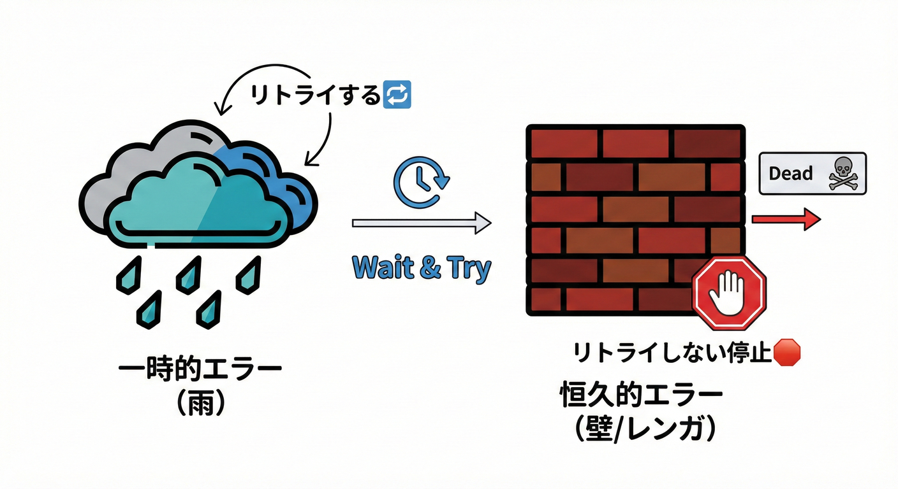
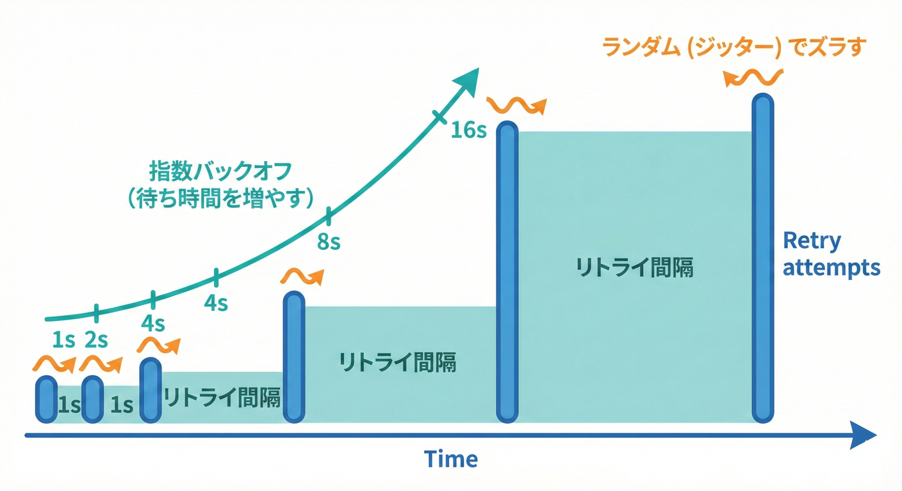
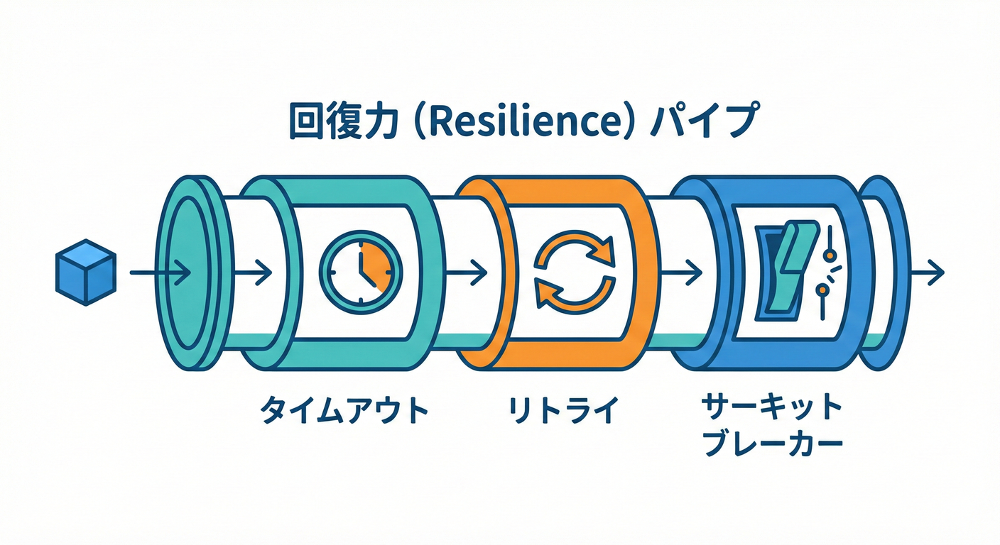

# 第25章 エラーモデリング超入口：リトライ可否を決める🔁🧯

## 25.0 この章でできるようになること🎓✨

* ドメインイベントの**ハンドラが失敗したとき**に「リトライする？しない？」を判断できる🙂🔍
* **一時的エラー🌧️**と**恒久的エラー🧱**をざっくり仕分けできる
* C#で「最小のリトライ」実装が書ける（バックオフ📈＋ジッター🎲）

---

## 25.1 リトライすべきエラー・すべきでないエラー🌫️🧱



エラーには「もう一度試せば直るもの（一時的）」と「何度やっても無駄なもの（永続的）」があります。

### 一時的エラー（Transient）🌧️

「時間がたてば直るかも」系。リトライの候補🙂

* ネットワーク一瞬落ちた📡💥
* タイムアウト⏱️
* 混雑で 429（待って）🚦
* サーバ側が 5xx（調子悪い）🏥

### 恒久的エラー（Permanent）🧱

「待っても直らない」系。基本は**リトライしない**🙅‍♀️

* 入力が不正（例：メールアドレスが壊れてる）📮❌
* 権限がない🔐❌
* 仕様的にNG（ビジネスルール違反）📜❌

---

## 25.2 リトライ可否は「3つの箱📦」で決める🧠✨

ハンドラの失敗を、まずこの3つに分類すると迷いが減るよ🙂🗂️

1. **RetryしてOK（Transient）🔁**
2. **Retryしない（Permanent）🧱**
3. **不明（Unknown）🤷‍♀️ → いったん少回数だけRetryして、ダメなら人に渡す👀**

> 「Unknownを無限リトライ」は事故の元⚠️（後で“リトライ嵐”になる）
> Azureの設計ガイドでも、**回数・時間を制限**して暴走を防ぐのが大事とされてるよ🧯 ([Microsoft Learn][1])

---

## 25.3 “リトライしていい”ための条件✅（超大事）

### 条件A：操作が「冪等（idempotent）」っぽい🧷

同じ処理を2回やっても、結果が壊れない（または二重実行を検知して無害化できる）こと💡

* 例：メール送信📧は二重送信になりやすい → **イベントIDで重複ガード**を入れるのが安心
* 例：ポイント付与🎁も二重が怖い → **(EventId, HandlerName) を記録して二度目はスキップ** など

### 条件B：エラーが「Transient」🌧️

Transientだけを狙ってリトライする（全部にリトライしない）🙂

### 条件C：リトライ予算（回数・時間）を決めてある💰⏱️

やりすぎは「リトライ嵐」で逆に壊す⚠️ ([Microsoft Learn][1])

---

## 25.4 リトライ戦略：指数バックオフとジッター⏳🎢



同じタイミングでリトライが集中してサーバーを攻撃してしまわないよう、待ち時間を少しずつ増やしたり、ランダムにズラしたりする技術です。
* **指数バックオフ**：失敗が続くほど待ち時間を伸ばす（相手を休ませる）😴
* **ジッター**：待ち時間にランダムを混ぜる（みんな同時に再突撃しない）🎲

バックグラウンド処理では、**指数バックオフ＋ジッター**が一般ガイドとして推奨されてるよ🧭 ([Microsoft Learn][2])
Polly でも「BackoffType=Exponential」「UseJitter=true」が用意されてる🙂 ([pollydocs.org][3])

---

## 25.5 「何回」「いつまで」を先に決める💰⏱️

おすすめの決め方（まずはこれでOK）🙂✨

* **最大回数**：3回〜5回くらい（小さくスタート）🔁
* **最大時間**：数秒〜数十秒（付随処理なら“長居しない”）⏳
* **無限リトライはしない**（リトライ嵐の入口）⚠️ ([Microsoft Learn][1])

Polly の Retry は「MaxRetryAttempts」などで制御できて、ジッターやバックオフも設定できるよ🔧 ([pollydocs.org][3])

---

## 25.6 実装①：ハンドラの失敗を“型”で表す🧾✨

まずは「失敗の種類」をコードで明確にしよう🙂
（例：OrderPaid ハンドラで外部メール送信が失敗…など）

```csharp
public enum FailureKind
{
    Transient,  // 一時的エラー（リトライ候補）
    Permanent   // 恒久的エラー（基本リトライしない）
}

public sealed record HandlerFailure(
    FailureKind Kind,
    string Reason,
    Exception? Exception = null
);

public sealed record HandlerResult(
    bool Succeeded,
    HandlerFailure? Failure = null
)
{
    public static HandlerResult Ok() =>
        new(true);

    public static HandlerResult Transient(string reason, Exception? ex = null) =>
        new(false, new(FailureKind.Transient, reason, ex));

    public static HandlerResult Permanent(string reason, Exception? ex = null) =>
        new(false, new(FailureKind.Permanent, reason, ex));
}
```

### ハンドラ側の使い方イメージ🧩

```csharp
public sealed class SendReceiptMailHandler : IDomainEventHandler<OrderPaid>
{
    private readonly IMailApiClient _mail;

    public SendReceiptMailHandler(IMailApiClient mail) => _mail = mail;

    public async Task<HandlerResult> HandleAsync(OrderPaid ev, CancellationToken ct)
    {
        try
        {
            await _mail.SendReceiptAsync(ev.OrderId, ev.CustomerEmail, ct);
            return HandlerResult.Ok();
        }
        catch (HttpRequestException ex)
        {
            // ネットワーク系 → 一時的扱いにしやすい
            return HandlerResult.Transient("Mail API network failure", ex);
        }
        catch (InvalidEmailException ex)
        {
            // 入力不正 → 待っても直らない
            return HandlerResult.Permanent("Invalid customer email", ex);
        }
    }
}
```

---

## 25.7 実装②：リトライ処理は “外側” にまとめる🧩🔁

ポイントはこれ👇

* ハンドラは「成功/失敗（種類つき）」を返す
* **ディスパッチャが**「Transientならリトライ、Permanentなら即やめる」を担当する

### .NETの“回復性（Resilience）”でリトライを組む🛡️

最近の .NET では、回復性のために
「Microsoft.Extensions.Resilience」「Microsoft.Extensions.Http.Resilience」などが用意されてるよ（旧「Microsoft.Extensions.Http.Polly」は非推奨）📦 ([Microsoft Learn][4])

#### 1) パイプライン（リトライ設定）を登録する🔧

```csharp
using Microsoft.Extensions.DependencyInjection;
using Polly;
using Polly.Retry;

const string pipelineKey = "DomainEventHandler-Retry";

builder.Services.AddResiliencePipeline(pipelineKey, static pipelineBuilder =>
{
    pipelineBuilder.AddRetry(new RetryStrategyOptions
    {
        // “Transientだけ”をリトライ対象に絞るのが安全🙂
        ShouldHandle = new PredicateBuilder()
            .Handle<TransientHandlerException>(),

        BackoffType = DelayBackoffType.Exponential,
        UseJitter = true,
        MaxRetryAttempts = 3,
        Delay = TimeSpan.FromMilliseconds(200),
    });
});
```

この「AddResiliencePipeline → GetPipeline → ExecuteAsync」で実行する流れは公式ガイドにあるよ📘 ([Microsoft Learn][4])
また Polly の Retry は「UseJitter」や「MaxRetryAttempts」などのオプションを持ってるよ🔁 ([pollydocs.org][3])

#### 2) ディスパッチャで実行（Transientだけ例外化してリトライ）🔁

```csharp
using Polly.Registry;

public sealed class TransientHandlerException : Exception
{
    public TransientHandlerException(string message, Exception? inner = null) : base(message, inner) { }
}

public sealed class PermanentHandlerException : Exception
{
    public PermanentHandlerException(string message, Exception? inner = null) : base(message, inner) { }
}

public sealed class DomainEventDispatcher
{
    private readonly ResiliencePipeline _pipeline;

    public DomainEventDispatcher(ResiliencePipelineProvider<string> provider)
    {
        _pipeline = provider.GetPipeline("DomainEventHandler-Retry");
    }

    public async Task DispatchOneHandlerAsync<TEvent>(
        IDomainEventHandler<TEvent> handler,
        TEvent ev,
        CancellationToken ct)
    {
        await _pipeline.ExecuteAsync(async token =>
        {
            HandlerResult result = await handler.HandleAsync(ev, token);

            if (result.Succeeded) return;

            if (result.Failure!.Kind == FailureKind.Permanent)
            {
                // Permanentはリトライしない（ShouldHandleに含めない）
                throw new PermanentHandlerException(result.Failure.Reason, result.Failure.Exception);
            }

            // Transientはリトライさせたいので、専用例外に変換
            throw new TransientHandlerException(result.Failure.Reason, result.Failure.Exception);

        }, ct);
    }
}
```

✅ これで

* Transient → 例外 → Pollyがリトライ
* Permanent → 例外（でもリトライ対象外）→ すぐ失敗で抜ける
  がハッキリ分かれるよ🙂✨ ([Microsoft Learn][4])

---

## 25.8 HTTP呼び出しは“標準セット”も使える🛡️🌐

外部APIを呼ぶハンドラが多いなら、HttpClient側に**標準の回復性ハンドラ**を付けるのも手早い🙂
「AddStandardResilienceHandler」で、複数戦略（リトライ等）を良い感じに積む標準が提供されてるよ📦 ([Microsoft Learn][5])

```csharp
builder.Services.AddHttpClient<IMailApiClient, MailApiClient>(client =>
{
    client.BaseAddress = new Uri("https://mail.example");
})
.AddStandardResilienceHandler();
```

※ 回復性ハンドラの“積み重ねすぎ”は避けよう、という注意もあるよ⚠️ ([Microsoft Learn][5])



---

## 25.9 ログ項目を決めよう🧾🔍（運用で泣かないやつ）

リトライするなら、最低限これだけあると助かる🙂✨

* EventName（例：OrderPaid）🔔
* EventId（重複ガードにも使う）🆔
* AggregateId（例：OrderId）🧺
* HandlerName（どのハンドラ？）🏷️
* AttemptNumber（何回目？）🔁
* FailureKind（Transient / Permanent）🌧️🧱
* ErrorType（例外の種類を短く）🧨
* ErrorMessage（短く！）📝
* NextDelay（次まで何ms？）⏳
* CorrelationId（ひと続きの処理ID）🧵
* Outcome（成功/恒久失敗/リトライ枯渇）✅❌

---

## 25.10 やってみよう🛠️（分類ゲーム🎮✨）

次のケースを「Transient / Permanent / Unknown」に分けてみよう🙂

1. メールAPIがタイムアウト⏱️
2. メールアドレスが “aaa@@@” 📮❌
3. 429（Rate Limit）🚦
4. 503（Service Unavailable）🏥
5. 「同じEventIdでポイント付与がもう済んでた」🎁（二重検知）

### 例の答え合わせ（考え方）💡

* 1. Transient（短いバックオフ＋ジッターで数回）
* 2. Permanent（直さないと無理）
* 3. Transient（待てば通ることが多い）
* 4. Transient（相手が回復するかも）
* 5. **成功扱いにしてOK**（冪等化できてるから最強💪）

---

## 25.11 チェック✅（5問ミニ）

1. リトライしていい前提条件を2つ言える？✅
2. 「Unknownを無限リトライ」が危ない理由は？⚠️ ([Microsoft Learn][1])
3. “指数バックオフ＋ジッター”の目的は？📈🎲 ([Microsoft Learn][2])
4. TransientとPermanentを分けるメリットは？🧠
5. 二重実行を防ぐためにイベント側で持っておくと嬉しいIDは？🆔

---

## 参考：2026年1月時点の言語・ランタイム🧠🗓️

* .NET 10（LTS）と C# 14 がリリース済みとして案内されているよ🪟✨ ([gihyo.jp][6])

[1]: https://learn.microsoft.com/en-us/azure/architecture/antipatterns/retry-storm/?utm_source=chatgpt.com "Retry Storm Antipattern - Azure Architecture Center"
[2]: https://learn.microsoft.com/en-us/azure/well-architected/design-guides/handle-transient-faults?utm_source=chatgpt.com "Recommendations for handling transient faults"
[3]: https://www.pollydocs.org/strategies/retry.html "Retry resilience strategy | Polly "
[4]: https://learn.microsoft.com/ja-jp/dotnet/core/resilience/ "回復性のあるアプリ開発の概要 - .NET | Microsoft Learn"
[5]: https://learn.microsoft.com/en-us/dotnet/core/resilience/http-resilience "Build resilient HTTP apps: Key development patterns - .NET | Microsoft Learn"
[6]: https://gihyo.jp/article/2025/11/dotnet-10?utm_source=chatgpt.com "Microsoft、.NET 10をリリース —— Visual Studio 2026も一般 ..."
