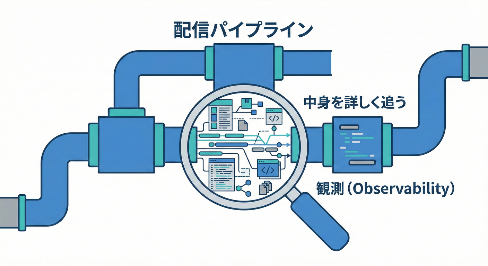
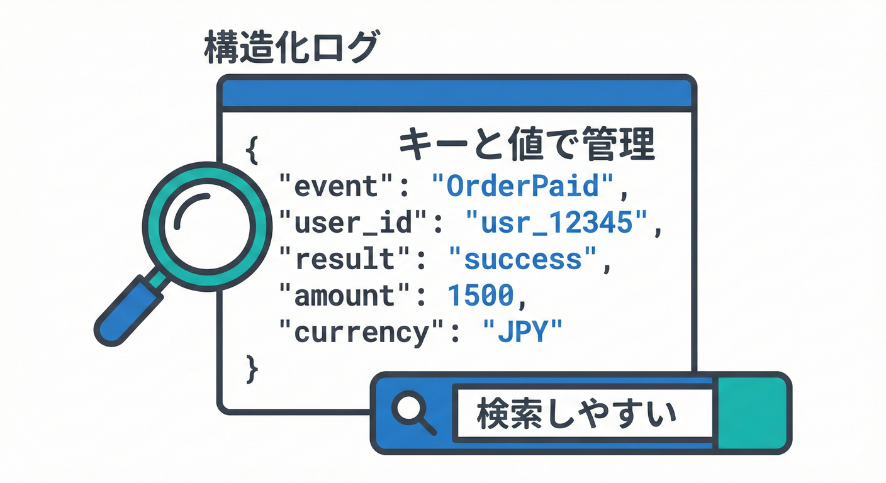
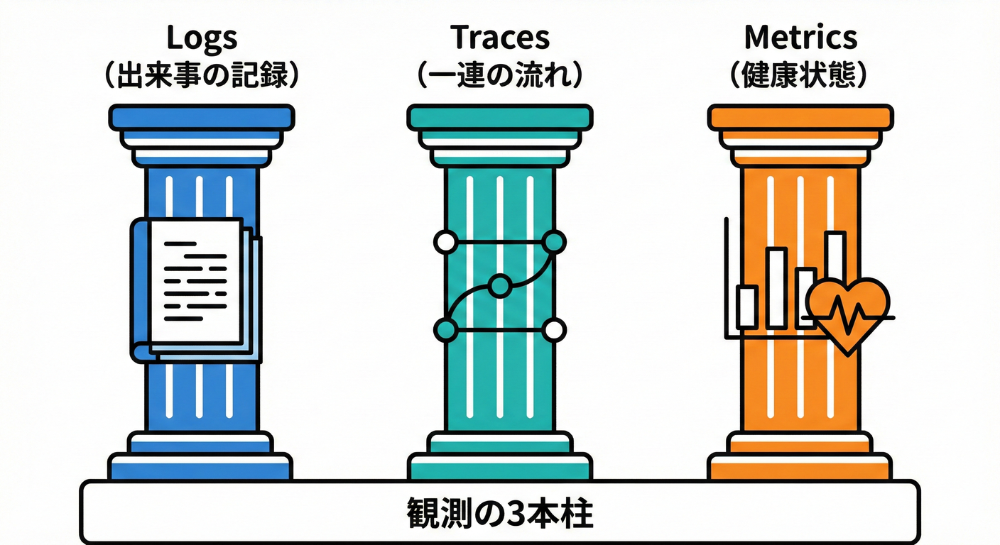

# 第26章 観測（オブザーバビリティ）最小セット🔭✨

## ねらい🎯

ドメインイベントまわりで「あとで追える」を作ります🙂🔎
つまり…**「いつ」「何が」「どの注文で」「どの処理の流れで」「成功/失敗したか」**が、ログや計測で辿れる状態にします🧵✨

---

## まず超ざっくり：オブザーバビリティって何？🧠✨

オブザーバビリティ（Observability）は、ざっくり言うと **“中で何が起きてるか外から分かる力”** です👀🔭
代表的な3本柱はこれ👇

* **Logs（ログ）** 🧾：出来事の記録（文章＋項目）
* **Traces（トレース）** 🧵：一連の処理の流れを1本の糸で追う
* **Metrics（メトリクス）** 📈：数値で健康状態を見る（回数・時間・失敗率）

この章では、最小セットとして **ログ中心＋相関ID＋最低限の計測** まで作ります🧩✨
（.NET は `ILogger` で高性能な構造化ログが扱えます🧾✨）([Microsoft Learn][1])

---

## 26.2 なぜ「観測」が必要なの？🔭✨



非同期処理や分散システムでは、「中で何が起きているか」を外から見えるようにしておくことが非常に重要です。
便利だけど、観測が弱いとこんな事故が起きがち👇😵‍💫

* 「メール送信だけ失敗したのに気づかない」📧💥
* 「どの注文の処理が詰まってるか分からない」🛒🌀
* 「同じイベントが二重で処理された？」🔁😱
* 「失敗ログはあるけど、成功した証拠がない」✅❓

だからこの章のゴールはこれ👇✨
**“イベント単位で、開始・終了・結果・時間・つながり” が記録されている** 状態🧾🧵⏱️

---

## 最小セットの設計図🗺️✨

イベント配信（Dispatcher）が、最低限これを残します👇

1. **イベントが配信された**（いつ/どれ/どの集約ID）🔔🧾
2. **どのハンドラが動いた**（開始/終了）🎯⏱️
3. **結果**（成功✅ / 失敗❌ と理由）🧯
4. **相関ID**（この一連の処理の“共通の糸”）🧵
5. **処理時間**（遅いを検知できる）🐢⚡

---

## ログの「テンプレ項目」📋✨（これだけ揃えれば強い）

まずはログを“文章だけ”にせず、**項目（フィールド）**を揃えます🧾➡️🧩
`ILogger` は構造化ログ（テンプレ＋値）を想定してます🙂✨([Microsoft Learn][1])

| 項目名                    | 例                   | 何のため？🙂         |
| ---------------------- | ------------------- | --------------- |
| `event_name`           | `OrderPaid`         | 何が起きた？🔔        |
| `aggregate_type`       | `Order`             | どの種類？🧺         |
| `aggregate_id`         | `order-123`         | どれの話？🪪         |
| `handler`              | `GrantPointHandler` | 誰が処理？🎯         |
| `result`               | `success` / `fail`  | 成否を一発で✅❌        |
| `duration_ms`          | `42`                | 遅いの検知⏱️         |
| `correlation_id`       | `...`               | 一連の流れで束ねる🧵     |
| `trace_id` / `span_id` | `...`               | ログ⇄トレースを紐づけ🧵🔗 |
| `error_type`           | `Transient`         | リトライ判断🔁        |
| `exception`            | `TimeoutException`  | 原因の入口🧯         |

> ✅ポイント：**成功ログも残す**
> 失敗だけだと「成功しているはずなのに見つからない…」が起きます🙂🌀

---

## 相関ID（Correlation ID）ってなに？🧵✨

相関IDは「この一連の処理は同じグループだよ〜」って束ねるIDです🧵
例：**注文確定→支払い→イベント配信→ポイント付与→メール送信** を1本の糸で追う感じ🙂✨

さらに強いのが **TraceId/SpanId** です🧵🔎
.NET は分散トレースで **W3C TraceContext** を使い、`Activity.TraceId`（トレース全体のID）と `Activity.SpanId`（区間のID）で流れを表せます🧵✨([Microsoft Learn][2])
OpenTelemetryでもログとトレースは `TraceId` / `SpanId` で相関できます🧾🔗🧵([OpenTelemetry][3])

> 🎀この教材の最小方針
>
> * まずは `correlation_id` を1つ付ける🧵
> * できれば `Activity`（TraceId/SpanId）も付ける🧵✨

---

## 実装のコア：BeginScopeで“共通項目”を自動で付ける🧾🧷

`ILogger.BeginScope()` を使うと、スコープ内のログに **同じ項目**を自動で付けられます✨
相関IDや注文IDを付けるのに超便利🙂🧵
（`BeginScope` はこういう相関情報を付けるための基本手段として説明されています）([nblumhardt.com][4])

---

## 例題：イベント配信で「開始→成功/失敗→時間」を残す🛠️🔔

### 1) ドメインイベントとハンドラ（最小）🧩

```csharp
public interface IDomainEvent
{
    DateTimeOffset OccurredAt { get; }
}

public interface IDomainEventHandler<in TEvent> where TEvent : IDomainEvent
{
    Task HandleAsync(TEvent domainEvent, CancellationToken ct);
}
```

### 2) Dispatcher：観測の中心（ここでログを揃える）🔭✨

* ここで **event_name / aggregate_id / correlation_id** をスコープで付ける🧵🧾
* 各ハンドラごとに **開始・終了・時間・失敗理由** を残す⏱️🧯

```csharp
using System.Diagnostics;
using Microsoft.Extensions.Logging;

public sealed class DomainEventDispatcher
{
    private readonly ILogger<DomainEventDispatcher> _logger;
    private readonly IServiceProvider _serviceProvider;

    public DomainEventDispatcher(
        ILogger<DomainEventDispatcher> logger,
        IServiceProvider serviceProvider)
    {
        _logger = logger;
        _serviceProvider = serviceProvider;
    }

    public async Task DispatchAsync(
        string aggregateType,
        string aggregateId,
        IReadOnlyList<IDomainEvent> events,
        string correlationId,
        CancellationToken ct)
    {
        foreach (var ev in events)
        {
            var eventName = ev.GetType().Name;

            using var scope = _logger.BeginScope(new Dictionary<string, object>
            {
                ["aggregate_type"] = aggregateType,
                ["aggregate_id"] = aggregateId,
                ["event_name"] = eventName,
                ["correlation_id"] = correlationId,
                // Activity があれば TraceId/SpanId も付ける（ログ⇄トレース相関用）
                ["trace_id"] = Activity.Current?.TraceId.ToString() ?? "",
                ["span_id"]  = Activity.Current?.SpanId.ToString()  ?? "",
            });

            _logger.LogInformation("Domain event dispatch started.");

            // ハンドラを列挙（DIから取得）
            var handlerType = typeof(IEnumerable<>).MakeGenericType(
                typeof(IDomainEventHandler<>).MakeGenericType(ev.GetType()));

            var handlersObj = _serviceProvider.GetService(handlerType);
            if (handlersObj is not System.Collections.IEnumerable handlers)
            {
                _logger.LogWarning("No handlers found for domain event.");
                continue;
            }

            foreach (var handler in handlers)
            {
                var handlerName = handler.GetType().Name;
                var sw = Stopwatch.StartNew();

                try
                {
                    _logger.LogInformation("Handler started. {handler}", handlerName);

                    // 動的呼び出し（学習用の簡略）
                    var method = handler.GetType().GetMethod("HandleAsync");
                    var task = (Task)method!.Invoke(handler, new object[] { ev, ct })!;
                    await task.ConfigureAwait(false);

                    sw.Stop();
                    _logger.LogInformation(
                        "Handler finished. {handler} {result} {duration_ms}",
                        handlerName, "success", sw.ElapsedMilliseconds);
                }
                catch (Exception ex)
                {
                    sw.Stop();
                    _logger.LogError(
                        ex,
                        "Handler failed. {handler} {result} {duration_ms}",
                        handlerName, "fail", sw.ElapsedMilliseconds);

                    // ここで「主処理を失敗扱いにするか」は第24章の方針に従う🙂
                    // 学習用としては、まず例外を投げ直さずログだけ残す案もアリ。
                }
            }

            _logger.LogInformation("Domain event dispatch finished.");
        }
    }
}
```

---

## 相関IDを作る場所（おすすめ）🧵✨

相関IDは「1つのユースケース（コマンド処理）」の入口で作るのが分かりやすいです🙂
そして可能なら `Activity` も開始すると、TraceId/SpanId が自然に乗ります🧵✨
（TraceId/SpanId の考え方は .NET の分散トレース概念として整理されています）([Microsoft Learn][2])

```csharp
using System.Diagnostics;

public static class Correlation
{
    private static readonly ActivitySource ActivitySource = new("MiniEC");

    public static IDisposable Start(string operationName, out string correlationId)
    {
        // correlation_id はまずはGUIDでOK🙂
        correlationId = Guid.NewGuid().ToString("N");

        // Trace（トレース）も開始しておくと、TraceId/SpanId が使える🧵
        var activity = ActivitySource.StartActivity(operationName, ActivityKind.Internal);

        // 返す IDisposable は activity（nullなら空）
        return activity ?? new NoopDisposable();
    }

    private sealed class NoopDisposable : IDisposable { public void Dispose() { } }
}
```

使う側はこんな感じ👇🛠️✨

```csharp
public async Task MarkOrderAsPaidAsync(string orderId, CancellationToken ct)
{
    using var _ = Correlation.Start("MarkOrderAsPaid", out var correlationId);

    // ここで Order.MarkAsPaid() → DomainEvents を溜める → DispatchAsync(...) の流れ
}
```

---

## 26.3 構造化ログ（Structured Logging）📜🏷️



単なる文字列の書き出しではなく、検索や分析がしやすい「キーと値のペア」の形式でログを残します。
たとえばイメージ👇（実際の出力形式はプロバイダ次第）

```json
{
  "level": "Information",
  "message": "Handler finished.",
  "event_name": "OrderPaid",
  "aggregate_type": "Order",
  "aggregate_id": "order-123",
  "handler": "GrantPointHandler",
  "result": "success",
  "duration_ms": 42,
  "correlation_id": "b8c1...",
  "trace_id": "4bf92f3577b34da6a3ce929d0e0e4736",
  "span_id": "00f067aa0ba902b7"
}
```

---

## メトリクス最小セット📈✨（2つだけでいい）

ログは“事件簿”🧾、メトリクスは“体温計”🌡️です🙂
.NET は `System.Diagnostics.Metrics` でメトリクス計装できます📈([Microsoft Learn][5])

最低限おすすめはこの2つ👇✨

1. **イベント配信失敗回数**（Counter）❌🔢
2. **ハンドラ処理時間**（Histogram）⏱️📊

```csharp
using System.Diagnostics.Metrics;

public static class ObservabilityMetrics
{
    private static readonly Meter Meter = new("MiniEC.DomainEvents");

    public static readonly Counter<long> DispatchFailures =
        Meter.CreateCounter<long>("domain_event_dispatch_failures");

    public static readonly Histogram<double> HandlerDurationMs =
        Meter.CreateHistogram<double>("domain_event_handler_duration_ms");
}
```

Dispatcherの中でこう使います👇

```csharp
// 成功/失敗で記録
ObservabilityMetrics.HandlerDurationMs.Record(sw.Elapsed.TotalMilliseconds,
    KeyValuePair.Create<string, object?>("event_name", eventName),
    KeyValuePair.Create<string, object?>("handler", handlerName));

if (failed)
{
    ObservabilityMetrics.DispatchFailures.Add(1,
        KeyValuePair.Create<string, object?>("event_name", eventName),
        KeyValuePair.Create<string, object?>("handler", handlerName));
}
```

> 🎀補足：`System.Diagnostics.Metrics` は OpenTelemetry のエコシステムとも統合しやすい設計です📈🔗([Microsoft Learn][6])

---

## ログ⇄トレース⇄メトリクスを外に出す（OpenTelemetry最小）🚚✨



「集めて見える化したい」になったら OpenTelemetry が便利です🧰✨
特に production では **OpenTelemetry Collector** 経由でエクスポートするのが推奨されています🚚📦([OpenTelemetry][7])
（ログも `ILogger` から取り込めます）([OpenTelemetry][8])

最小のイメージ（概念コード）👇

```csharp
// builder.Services.AddOpenTelemetry()
//   .WithTracing(tracing =>
//   {
//       tracing.AddSource("MiniEC");
//       tracing.AddAspNetCoreInstrumentation();
//       tracing.AddHttpClientInstrumentation();
//       tracing.AddOtlpExporter(); // OTLP で Collector へ
//   })
//   .WithMetrics(metrics =>
//   {
//       metrics.AddMeter("MiniEC.DomainEvents");
//       metrics.AddAspNetCoreInstrumentation();
//       metrics.AddOtlpExporter();
//   });
```

そして、ログとトレースを相関したいなら **TraceId/SpanId をログに入れる**のが基本です🧾🔗🧵([OpenTelemetry][3])

---

## “見える化”のための小さなルール✅✨

### レベル設計（最低限）🧾

* `Information`：開始/終了/成功✅（日常の追跡）
* `Warning`：おかしい兆候⚠️（リトライ予定、ハンドラ未登録など）
* `Error`：失敗❌（例外付き）

### ログに入れないもの🙅‍♀️🧯

* パスワード・カード情報・トークン・個人情報（そのまま）🧨
* 巨大オブジェクト丸ごと（ログ肥大）🐘💦

### 例外ログのコツ🧯✨

* `ex` を渡してスタックトレースも残す（原因の入口）📌
* `error_type`（Transient/Permanent）も一緒に残すと運用が楽🔁🧱

---

## やってみよう🛠️🎀（演習）

### 演習1：ログ項目テンプレを作る📋✨

「第26章の表」をそのままプロジェクト用のテンプレにして、
`event_name / aggregate_id / handler / result / duration_ms / correlation_id` は必須にする✅🧾

### 演習2：BeginScopeで注文IDを全ログに付ける🧵

* `DispatchAsync()` の最初で `BeginScope`
* どのログにも `aggregate_id` が付いてることを確認🔎✨

### 演習3：処理時間メトリクスを入れる⏱️📈

* `Histogram` に `handler` と `event_name` タグを付ける
* 「遅いハンドラ」が見つけられる状態にする🐢🔍

---

## チェック✅（理解度ミニテスト）

1. イベント配信で「成功ログ」も必要なのはなぜ？🙂
2. `correlation_id` と `TraceId` はどう違う？🧵
3. `BeginScope` を使うと何が嬉しい？🧾✨
4. 最小のメトリクス2つ（Counter / Histogram）で何を測る？📈⏱️

---

## おまけ：AI拡張に頼むときの“良い聞き方”🤖💡

* 「このログ項目（表）を満たす `ILogger` 実装にして、BeginScopeで共通項目を付けて」🧾🧵
* 「例外時に `error_type` を分類する最小ルール案を出して」🧯🔁
* 「Histogram/Counter の計測ポイントを、過不足なくレビューして」📈🔍

（生成されたコードは、**“このログで何が追える？”**を自分の言葉で説明できたら合格🎓✨）

[1]: https://learn.microsoft.com/en-us/dotnet/core/extensions/logging?utm_source=chatgpt.com "Logging in C# - .NET"
[2]: https://learn.microsoft.com/ja-jp/dotnet/core/diagnostics/distributed-tracing-concepts?utm_source=chatgpt.com "分散トレースの概念 - .NET"
[3]: https://opentelemetry.io/docs/languages/dotnet/logs/correlation/?utm_source=chatgpt.com "Log correlation"
[4]: https://nblumhardt.com/2016/11/ilogger-beginscope/?utm_source=chatgpt.com "The semantics of ILogger.BeginScope()"
[5]: https://learn.microsoft.com/en-us/dotnet/core/diagnostics/metrics-instrumentation?utm_source=chatgpt.com "Creating Metrics - .NET"
[6]: https://learn.microsoft.com/ja-jp/dotnet/api/system.diagnostics.metrics?view=net-10.0&utm_source=chatgpt.com "System.Diagnostics.Metrics 名前空間"
[7]: https://opentelemetry.io/docs/languages/dotnet/exporters/?utm_source=chatgpt.com "Exporters"
[8]: https://opentelemetry.io/ja/docs/languages/dotnet/logs/?utm_source=chatgpt.com "OpenTelemetry .NET logs"
