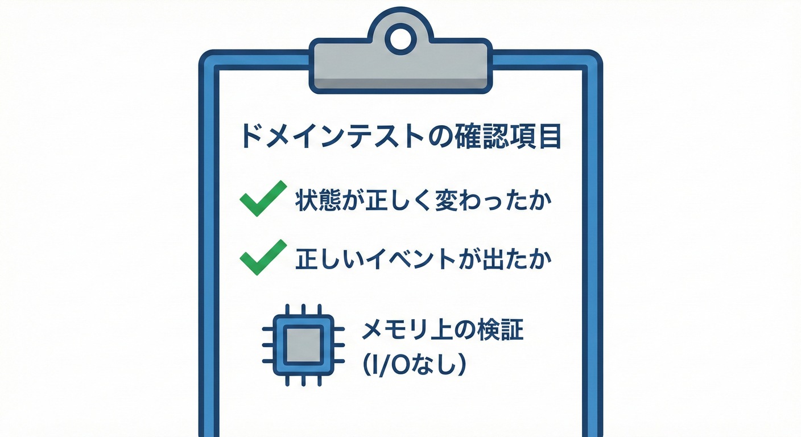
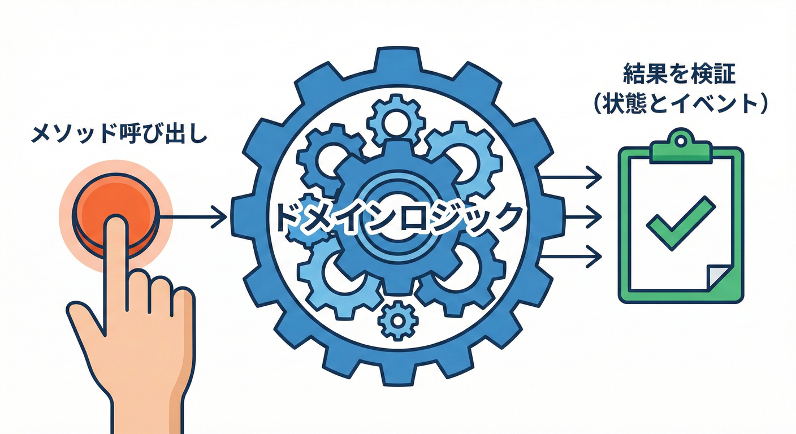

# 第27章：テスト①：ドメインの単体テスト（イベント発生を確認）🧪🔔

## 27.1 テストの基本方針：I/Oを混ぜない🧪🧼



ドメインロジックのテストは、データベースやネットワークに依存せず、メモリ上だけで完結するように作ります。

* **ドメインの状態変更**（例：支払い完了）を呼ぶ
* その結果として

  * **状態が正しく変わる**✅
  * **ドメインイベントが追加される**✅
    を **単体テストで確認**するよ〜！🧡

---

## まず大事：ドメイン単体テストは何がうれしい？🥰

ドメインイベントを使うと、**「何が起きたか」**がコードに残るよね🔔
テストではそれを確認することで、

* 「支払い完了したら、OrderPaid が必ず出る」みたいに
  **イベントが仕様（ルール）になる**🧩✨
* DBも外部APIも無しで回せるから
  **速い・安定・壊れにくい**🏃‍♀️💨

---

## 最新のテスト環境メモ（2026年1月時点）🗓️✨

* .NET は **.NET 10 系が LTS**として提供されていて、月次で更新されてるよ〜🪟🔧 ([Microsoft][1])
* xUnit は **v3 系（例：xunit.v3 3.2.2）**が NuGet で利用できるよ🧪 ([NuGet][2])
* Visual Studio のテストエクスプローラー連携は **xunit.runner.visualstudio** が担当（v3 も動く）🧩 ([NuGet][3])
* MSTest は **v4 が stable** として案内されてるよ（移行ガイドあり）🧪 ([Microsoft Learn][4])

※この章のサンプルは **xUnit** で書くね（読みやすくて定番✨）

---

## 良い「ドメイン単体テスト」3か条📌🧠

1. **I/Oしない**（DB・HTTP・ファイル・時計直読み、ぜんぶ無し）🙅‍♀️
2. **状態**と**イベント**だけ見る（内部の実装に依存しない）👀✨
3. **1テスト＝1ルール**（欲張らない）🍰

---

## サンプル：Order が Paid になったら OrderPaid を出す🛒💳🔔

### 27.2 ドメインロジックのテスト：状態とイベント🔔📦



メソッドを呼び出した後、「状態が正しく変わったか」と「正しいイベントが発行されたか」を確認します。
溜める、超ベーシック型だよ📮🧺

```csharp
// Domain/Events/IDomainEvent.cs
namespace MiniEC.Domain.Events;

public interface IDomainEvent
{
    DateTimeOffset OccurredAt { get; }
}
```

```csharp
// Domain/Orders/OrderStatus.cs
namespace MiniEC.Domain.Orders;

public enum OrderStatus
{
    Draft = 0,
    PendingPayment = 1,
    Paid = 2
}
```

```csharp
// Domain/Orders/OrderPaid.cs
using MiniEC.Domain.Events;

namespace MiniEC.Domain.Orders;

public sealed record OrderPaid(
    Guid OrderId,
    Guid PaymentId,
    DateTimeOffset OccurredAt
) : IDomainEvent;
```

```csharp
// Domain/Orders/Order.cs
using MiniEC.Domain.Events;

namespace MiniEC.Domain.Orders;

public sealed class Order
{
    private readonly List<IDomainEvent> _domainEvents = new();

    public Guid Id { get; }
    public OrderStatus Status { get; private set; } = OrderStatus.PendingPayment;

    // 読み取り専用で公開（外からAddさせない）
    public IReadOnlyCollection<IDomainEvent> DomainEvents => _domainEvents.AsReadOnly();

    public Order(Guid id)
    {
        Id = id;
    }

    public void MarkAsPaid(Guid paymentId, DateTimeOffset occurredAt)
    {
        if (Status == OrderStatus.Paid)
            throw new InvalidOperationException("Order is already paid.");

        Status = OrderStatus.Paid;

        _domainEvents.Add(new OrderPaid(
            OrderId: Id,
            PaymentId: paymentId,
            OccurredAt: occurredAt
        ));
    }

    // 「回収したら空にする」派ならこれ（どっちでもOK✨）
    public IReadOnlyList<IDomainEvent> PullDomainEvents()
    {
        var events = _domainEvents.ToList();
        _domainEvents.Clear();
        return events;
    }
}
```

ポイントはここ👇💡

* `DateTimeOffset.UtcNow` を**メソッド内で直接呼ばず**、`occurredAt` を引数で受け取る
  → テストがブレないよ〜🧊✨

---

### ② テスト側：MarkAsPaid したらイベントが入るか確認🧪🔔

#### xUnit（標準Assert版）✍️

```csharp
using MiniEC.Domain.Orders;
using Xunit;

public sealed class OrderDomainTests
{
    [Fact]
    public void MarkAsPaid_should_change_status_and_add_OrderPaid_event()
    {
        // Arrange 🧸
        var orderId = Guid.NewGuid();
        var paymentId = Guid.NewGuid();
        var occurredAt = new DateTimeOffset(2026, 1, 27, 0, 0, 0, TimeSpan.Zero);

        var order = new Order(orderId);

        // Act 🏃‍♀️
        order.MarkAsPaid(paymentId, occurredAt);

        // Assert ✅（状態）
        Assert.Equal(OrderStatus.Paid, order.Status);

        // Assert ✅（イベント）
        var ev = Assert.Single(order.DomainEvents);
        var paid = Assert.IsType<OrderPaid>(ev);

        Assert.Equal(orderId, paid.OrderId);
        Assert.Equal(paymentId, paid.PaymentId);
        Assert.Equal(occurredAt, paid.OccurredAt);
    }
}
```

#### もっと読みやすくしたい人向け（FluentAssertions版）🌸

FluentAssertions は読みやすいけど、**v8 以降はライセンス方針が変わった案内**があるから、チームのルールに合わせてね📜✨ ([Fluent Assertions][5])

```csharp
using FluentAssertions;
using MiniEC.Domain.Orders;
using Xunit;

public sealed class OrderDomainTests_Fluent
{
    [Fact]
    public void MarkAsPaid_should_emit_OrderPaid()
    {
        var orderId = Guid.NewGuid();
        var paymentId = Guid.NewGuid();
        var occurredAt = new DateTimeOffset(2026, 1, 27, 0, 0, 0, TimeSpan.Zero);

        var order = new Order(orderId);

        order.MarkAsPaid(paymentId, occurredAt);

        order.Status.Should().Be(OrderStatus.Paid);

        order.DomainEvents.Should().ContainSingle()
            .Which.Should().BeOfType<OrderPaid>()
            .Subject.Should().BeEquivalentTo(new OrderPaid(orderId, paymentId, occurredAt));
    }
}
```

---

## 追加で「仕様っぽいテスト」をもう1つ🧪🧡

「二重支払いは禁止！」みたいな不変条件をテストで固めると、安心感が一気に上がるよ🔒✨

```csharp
using MiniEC.Domain.Orders;
using Xunit;

public sealed class OrderDomainInvariantTests
{
    [Fact]
    public void MarkAsPaid_twice_should_throw_and_not_add_second_event()
    {
        var order = new Order(Guid.NewGuid());
        var t = new DateTimeOffset(2026, 1, 27, 0, 0, 0, TimeSpan.Zero);

        order.MarkAsPaid(Guid.NewGuid(), t);

        var beforeCount = order.DomainEvents.Count;

        Assert.Throws<InvalidOperationException>(() =>
            order.MarkAsPaid(Guid.NewGuid(), t.AddMinutes(1)));

        Assert.Equal(beforeCount, order.DomainEvents.Count);
    }
}
```

ここでの気持ちいいポイント👇😍

* 例外が出るのも **仕様**
* 「イベントが増えない」も **仕様**
  この2つがテストで固定される✨

---

## ありがち落とし穴あるある⚠️😵‍💫

* **イベントの中に “でっかい注文オブジェクト丸ごと” を入れる**
  → テストが重い＆依存が増える🐘💦
* **DateTime.Now / UtcNow をドメインが直接使う**
  → テストが不安定になる（特に並列や境界）⏱️💥
* **イベントの数や型だけ見て、内容（OrderIdなど）を見ない**
  → うっかりバグがすり抜ける🕳️

---

## Copilot / Codex に頼むときのコツ🤖✨

「テストの雛形を作らせる」のは超アリ！🧁
ただし、**仕様の判断（何を保証したいか）**は人間が決めるのが最強だよ💪🙂

使いやすいお願い例👇

* 「`Order.MarkAsPaid` の **単体テスト**を xUnit で作って。
  **状態**と **OrderPaid イベント**の両方を検証して」
* 「二重支払いのケースも追加して。例外とイベント数を確認して」

---

## チェックリスト✅📋

* [ ] テストが **I/O無し**で動いてる
* [ ] **状態**（Paidになった）を確認してる
* [ ] **イベント**（OrderPaidが出た）を確認してる
* [ ] イベントの中身（OrderId / occurredAt など）も見てる
* [ ] 不変条件（例：二重支払い禁止）も1つテストにできた 🔒✨

[1]: https://dotnet.microsoft.com/ja-jp/download/dotnet?utm_source=chatgpt.com "ダウンロードするすべての .NET バージョンを参照する"
[2]: https://www.nuget.org/packages/xunit.v3?utm_source=chatgpt.com "xunit.v3 3.2.2"
[3]: https://www.nuget.org/packages/xunit.runner.visualstudio?utm_source=chatgpt.com "xunit.runner.visualstudio 3.1.5"
[4]: https://learn.microsoft.com/en-us/dotnet/core/testing/unit-testing-mstest-migration-v3-v4?utm_source=chatgpt.com "MSTest migration from v3 to v4 - .NET"
[5]: https://www.fluentassertions.com/releases/?utm_source=chatgpt.com "Releases"
