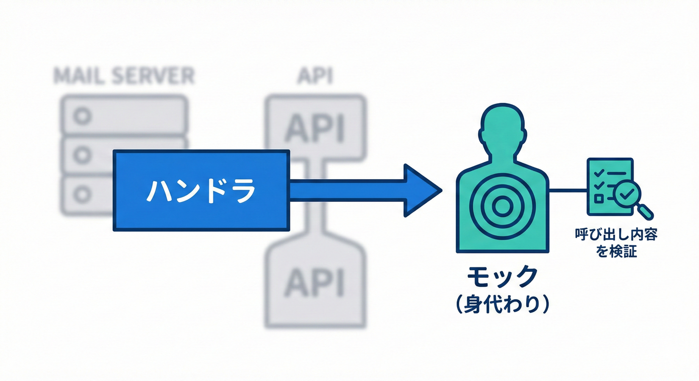
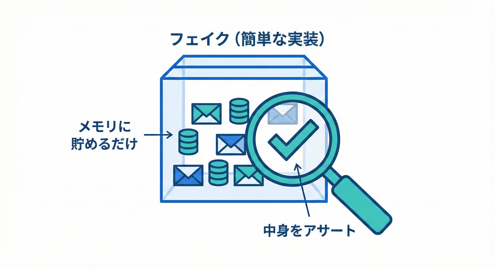

# 第28章 テスト②：ハンドラ単体テスト（外部I/Oは差し替え）🎭🧪

## この章のゴール🎯✨

* ドメインイベントの**ハンドラだけ**を、サクッと速くテストできるようになる🏃‍♀️💨
* メール送信📧・HTTP呼び出し🌐・DB書き込み💾みたいな**外部I/Oをテストから追い出す**やり方がわかる🙅‍♀️➡️🧩
* 「呼ばれた？」「正しい内容で呼ばれた？」を**モック/フェイク**で確認できる✅
* 失敗時（例外💥）のふるまいも、方針どおりにテストできるようになる🧯🔁

---

## 28.2 ハンドラーのテスト戦略：依存のモック化🎯🛡️



本物のメールサーバーの代わりに、「モック」や「フェイク」を使って、ハンドラーが正しく動こうとしたかを確認します。

## まず超大事：ハンドラの単体テストって何するの？🤔🧪

ドメインイベントのハンドラは、だいたいこういう“付随処理”を担当します👇

* メール送る📧
* Slack通知する💬
* ポイント付与する🎁
* 外部API叩く🌐
* ログ出す🧾
## 28.1 ハンドラーテストの難しさ⚖️🧩



ハンドラーは外部サービス（メール送信など）と関わることが多いため、そのままではテストしにくいという課題があります。

* ネットワーク次第で落ちる🌧️
* メール実送信しちゃう😱
* テストが遅い🐢
* “たまに落ちる”最悪の状態になる💔

だから**ハンドラ単体テスト**ではこうします👇

✅ **外部I/Oはインターフェースの“差し替え”にする**
✅ テストでは“偽物（モック/フェイク）”を渡して、**呼び出しだけ検証**する

---

## 2026時点のテスト環境（情報アップデート）🆕🧠

* .NET 10 は LTS（長期サポート）で、2025/11/11 にリリースされています📅✨ ([Microsoft for Developers][1])
* xUnit は v3 系が進んでいて、最新リリース一覧では **xunit.v3 3.2.2** が掲載されています🧪 ([xUnit.net][2])

  * v3 は **.NET 8+ をサポート**（つまり今どきの .NET ならOK）です👍 ([xUnit.net][3])
  * Visual Studio 用アダプタも提供されています（例：xunit.runner.visualstudio）🧩 ([NuGet][4])
* モック（偽物を作るライブラリ）として Moq は今も定番で、NuGet では **4.20.72** が確認できます🎭 ([NuGet][5])

この章は、**xUnit + Moq**でいきます💪✨（他でも考え方は同じだよ🙂）

---

## モックとフェイク、どう使い分ける？🎭🧸

ざっくりでOK！覚え方はこれ👇

* **モック（Mock）**🎭：
  「このメソッド呼ばれた？何回？どんな引数？」を検証したいときに強い✅
* **フェイク（Fake）**🧸：
  “テスト専用の簡単な実装”を作って、呼ばれた内容をメモしておく✅

最初は **どっちでもOK**。
ただ、初心者さんはフェイクのほうが「何が起きてるか」見えやすいことが多いよ👀✨

---

## 例題：支払い完了（OrderPaid）でメールを送る📧🔔

### 登場人物（最小セット）🧩

* イベント：`OrderPaid`
* ハンドラ：`SendReceiptEmailHandler`
* 外部I/O：`IEmailSender`（SMTPや外部メールAPIのつもり）

---

## 実装（イベント・インターフェース・ハンドラ）🧩🛠️

```csharp
using System;
using System.Threading;
using System.Threading.Tasks;

public sealed record OrderPaid(
    Guid OrderId,
    string CustomerEmail,
    DateTimeOffset OccurredAtUtc
);

public interface IEmailSender
{
    Task SendAsync(string to, string subject, string body, CancellationToken ct);
}

public sealed class SendReceiptEmailHandler
{
    private readonly IEmailSender _emailSender;

    public SendReceiptEmailHandler(IEmailSender emailSender)
        => _emailSender = emailSender;

    public async Task HandleAsync(OrderPaid ev, CancellationToken ct = default)
    {
        // ここでは「メール文面づくり」は超簡略化🙂
        var subject = $"Receipt for Order {ev.OrderId}";
        var body = $"Thank you! Paid at {ev.OccurredAtUtc:O}";

        await _emailSender.SendAsync(ev.CustomerEmail, subject, body, ct);
    }
}
```

ポイント🌟

* ハンドラは「メールを送る」という**やりたいこと**だけ持つ🎯
* SMTPとかHTTPとか、外の世界は `IEmailSender` に押し込める📦

---

## テスト①：Moqで「呼ばれたこと」を検証する✅🎭

```csharp
using System;
using System.Threading;
using System.Threading.Tasks;
using Moq;
using Xunit;

public class SendReceiptEmailHandlerTests
{
    [Fact]
    public async Task HandleAsync_SendsEmail_WithExpectedToAndSubject()
    {
        // Arrange 🧩
        var emailSenderMock = new Mock<IEmailSender>();

        var handler = new SendReceiptEmailHandler(emailSenderMock.Object);

        var ev = new OrderPaid(
            OrderId: Guid.Parse("aaaaaaaa-bbbb-cccc-dddd-eeeeeeeeeeee"),
            CustomerEmail: "alice@example.com",
            OccurredAtUtc: DateTimeOffset.Parse("2026-01-01T12:00:00+00:00")
        );

        // Act 🏃‍♀️
        await handler.HandleAsync(ev, CancellationToken.None);

        // Assert ✅
        emailSenderMock.Verify(x =>
            x.SendAsync(
                "alice@example.com",
                "Receipt for Order aaaaaaaa-bbbb-cccc-dddd-eeeeeeeeeeee",
                It.Is<string>(body => body.Contains("Paid at")),
                It.IsAny<CancellationToken>()
            ),
            Times.Once
        );
    }
}
```

### ここで学ぶこと📚

* **外部I/Oは実行しない**（本物メールは飛ばない📧❌）
* 代わりに「送信メソッドが、期待どおり呼ばれたか」を見る✅

---

## テスト②：フェイクで「送った内容」をまるっと見る🧸👀

モックがちょい難しく感じたら、フェイクでもぜんぜんOK！

```csharp
using System.Collections.Generic;
using System.Threading;
using System.Threading.Tasks;

public sealed class FakeEmailSender : IEmailSender
{
    public sealed record SentMail(string To, string Subject, string Body);

    private readonly List<SentMail> _sent = new();
    public IReadOnlyList<SentMail> Sent => _sent;

    public Task SendAsync(string to, string subject, string body, CancellationToken ct)
    {
        _sent.Add(new SentMail(to, subject, body));
        return Task.CompletedTask;
    }
}
```

```csharp
using System;
using System.Threading.Tasks;
using Xunit;

public class SendReceiptEmailHandler_FakeTests
{
    [Fact]
    public async Task HandleAsync_AddsOneMail_ToFakeSender()
    {
        // Arrange 🧩
        var fake = new FakeEmailSender();
        var handler = new SendReceiptEmailHandler(fake);

        var ev = new OrderPaid(
            Guid.NewGuid(),
            "alice@example.com",
            DateTimeOffset.UtcNow
        );

        // Act 🏃‍♀️
        await handler.HandleAsync(ev);

        // Assert ✅
        Assert.Single(fake.Sent);
        Assert.Equal("alice@example.com", fake.Sent[0].To);
        Assert.Contains("Receipt for Order", fake.Sent[0].Subject);
    }
}
```

フェイクの良さ✨

* 何が送られたか、**配列で見える**👀
* 初学者にやさしい🙂🎀

---

## 失敗時のテスト：例外を“どう扱うか”を決める💥🧯

ここ、超大事ポイント！
「メール送信が失敗したら、注文確定（主処理）まで失敗にする？」問題があるよね😵‍💫

この章は**ハンドラ単体テスト**なので、方針は2パターンで紹介するね👇
（どっちが正しいかは業務次第🙂）

---

### パターンA：失敗したら例外をそのまま投げる（呼び出し元で判断）💥

この場合は「例外が起きること」をテストする✅

```csharp
using System;
using System.Threading;
using System.Threading.Tasks;
using Moq;
using Xunit;

public class SendReceiptEmailHandler_FailureTests
{
    [Fact]
    public async Task HandleAsync_WhenEmailSenderThrows_PropagatesException()
    {
        // Arrange
        var mock = new Mock<IEmailSender>();
        mock.Setup(x => x.SendAsync(
                It.IsAny<string>(),
                It.IsAny<string>(),
                It.IsAny<string>(),
                It.IsAny<CancellationToken>()))
            .ThrowsAsync(new InvalidOperationException("SMTP down"));

        var handler = new SendReceiptEmailHandler(mock.Object);

        var ev = new OrderPaid(Guid.NewGuid(), "alice@example.com", DateTimeOffset.UtcNow);

        // Act & Assert
        await Assert.ThrowsAsync<InvalidOperationException>(() => handler.HandleAsync(ev));
    }
}
```

---

### パターンB：失敗は飲み込んでログだけ出す（主処理を守る）🧾🙂

この場合は、ハンドラ側をこう変える👇（例外を握りつぶす代わりにログ）

```csharp
using Microsoft.Extensions.Logging;

public sealed class SendReceiptEmailHandler_WithLogging
{
    private readonly IEmailSender _emailSender;
    private readonly ILogger<SendReceiptEmailHandler_WithLogging> _logger;

    public SendReceiptEmailHandler_WithLogging(
        IEmailSender emailSender,
        ILogger<SendReceiptEmailHandler_WithLogging> logger)
    {
        _emailSender = emailSender;
        _logger = logger;
    }

    public async Task HandleAsync(OrderPaid ev, CancellationToken ct = default)
    {
        try
        {
            var subject = $"Receipt for Order {ev.OrderId}";
            var body = $"Thank you! Paid at {ev.OccurredAtUtc:O}";
            await _emailSender.SendAsync(ev.CustomerEmail, subject, body, ct);
        }
        catch (Exception ex)
        {
            _logger.LogError(ex, "Failed to send receipt email. OrderId={OrderId}", ev.OrderId);
            // 飲み込む（方針！）
        }
    }
}
```

#### ログのテストは「FakeLogger」を使うとラク🧪🧾

`FakeLogger` はテスト向けにログをメモリに貯めて検証できる仕組みで、ドキュメントでも「ユニットテスト用」と説明されています🧠✨ ([Microsoft Learn][6])
（関連パッケージとして `Microsoft.Extensions.Diagnostics.Testing` が使われます） ([NuGet][7])

※ここは「ログまでテストしたい人向け」の発展💡（必須じゃないよ🙂）

---

## ハンドラ単体テストの“勝ちパターン”まとめ🏆✨

### ✅ 1. テスト対象は「ハンドラ1個だけ」

* Dispatcher や DI コンテナは持ち込まない🙅‍♀️
* **new して呼ぶだけ**が最強に安定する💪

### ✅ 2. 外部I/Oは「インターフェース1枚」で隔離

* `IEmailSender` / `ISlackClient` / `IHttpClient`（薄い自作）みたいに分ける🧩
* “詳細”を奥に押し込む📦

### ✅ 3. Assertは「重要なことだけ」

* 件数（1回だけ送った？）✅
* 宛先/件名（ドメイン的に重要？）✅
* 本文の全部一致は、壊れやすいからほどほどに🙂

---

## よくあるつまずき集😵‍💫🧯

### ❌ `async` を `await` してなくてテストがすり抜ける

→ テストメソッドも `async Task` にして、必ず `await` する✅

### ❌ モックの Verify が通らない（CancellationToken違い）

→ `It.IsAny<CancellationToken>()` でまず通す、必要なら厳密化🎯

### ❌ “イベントの中身”に巨大オブジェクトを入れてテストが地獄

→ そのイベント、太りすぎ🐘💦（第17章の復習！）
必要最小限に絞る✂️✨

---

## やってみよう🛠️🎀（練習問題）

### 練習1📧

`OrderPaid` で「購入ありがとうメール」ではなく、**領収書メール**を送る仕様にして

* 件名に `OrderId` を入れる
* 本文に `OccurredAtUtc` を入れる
  この2点をテストで確認してみよう✅

### 練習2🎁

`OrderPaid` の別ハンドラとして `GrantPointsHandler` を作ってみよう🎁

* `IPointService.AddAsync(customerId, points)` を呼ぶだけにする
* テストは「1回呼ばれたか」だけでOK✅

### 練習3🧯（発展）

メール送信が落ちたとき、

* **例外を投げる方針**💥
* **ログだけ出して飲み込む方針**🙂
  どっちにするか決めて、テストもそれに合わせて作ろう✅

---

## AI拡張の使いどころ🤖✨（安全に時短！）

* 「Arrange-Act-Assert の形で、xUnit のテスト雛形を作って」🧪
* 「このインターフェースのフェイク実装を、最小の記録機能つきで作って」🧸
* 「Verify が通らない原因を、CancellationToken/引数/await 観点でチェックして」🔎

⚠️ ただし、**例外を投げる/飲み込む**みたいな“方針”はAI任せにせず、必ず自分で決めるのがコツだよ🎯🙂

---

## チェック✅✨

* [ ] ハンドラ単体テストでは、外部I/Oを本物で呼んでない🙅‍♀️
* [ ] `IEmailSender` みたいなインターフェースで差し替えできてる🧩
* [ ] モック or フェイクで「呼ばれたこと」を検証できた🎭🧸
* [ ] 失敗時の方針（投げる/飲み込む）がテストで守れてる🧯✅

---

[1]: https://devblogs.microsoft.com/dotnet/announcing-dotnet-10/?utm_source=chatgpt.com "Announcing .NET 10"
[2]: https://xunit.net/releases/?utm_source=chatgpt.com "Release Notes"
[3]: https://xunit.net/?utm_source=chatgpt.com "xUnit.net: Home"
[4]: https://www.nuget.org/packages/xunit.runner.visualstudio?utm_source=chatgpt.com "xunit.runner.visualstudio 3.1.5"
[5]: https://www.nuget.org/packages/moq/?utm_source=chatgpt.com "Moq 4.20.72"
[6]: https://learn.microsoft.com/ja-jp/dotnet/api/microsoft.extensions.logging.testing.fakelogger?view=net-9.0-pp&utm_source=chatgpt.com "FakeLogger Class (Microsoft.Extensions.Logging.Testing)"
[7]: https://www.nuget.org/packages/Microsoft.Extensions.Diagnostics.Testing/?utm_source=chatgpt.com "Microsoft.Extensions.Diagnostics.Testing 10.2.0"
