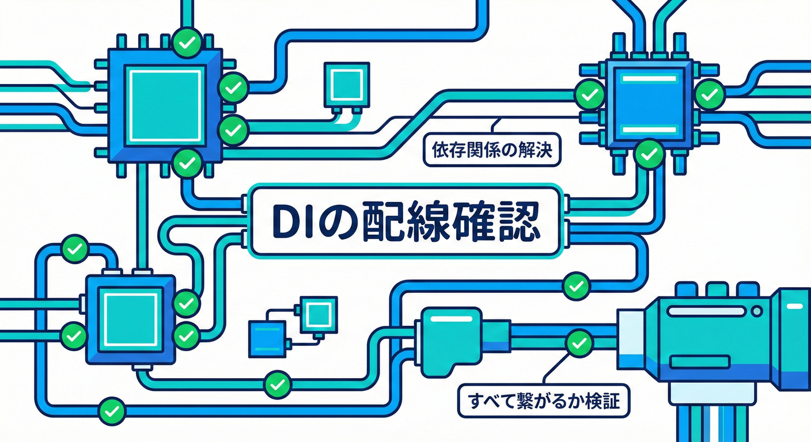

# 第29章 テスト③：統合テスト（DI構成で通し確認）🧩🏁

## この章のゴール🎯✨

統合テストで、次の「つながり」を**まとめて**確認できるようになります🙂🔗

* DI登録が正しい（解決できる）🧰✅
* ユースケース実行 → 集約の状態変更 → ドメインイベント発生 🔔
* イベントがディスパッチされて、**ハンドラがちゃんと動く**📣➡️🎯
* 「登録ミス」「配信漏れ」をテストで早期発見🔎💥

> 統合テストは、単体テストより広く、複数コンポーネントが一緒に動くことを確認するテストです🙂 ([Microsoft Learn][1])

---

## 統合テストは“ここまで”やる（やりすぎ防止）🚧😇

統合テストは、全部を網羅しなくてOKです。**重要な少数ケース**に絞るのがコツ🙂✨

### 3段階のうち、まずは真ん中を狙う🎯

1. **単体テスト（第27章）**：ドメインがイベントを出すか🧪🔔
2. **ハンドラ単体テスト（第28章）**：ハンドラが副作用を起こすか🧪🎭
3. **統合テスト（第29章）**：**DI + ディスパッチの配線**が全部つながるか🧩🏁 ← 今ここ！

---

## 29.1 DIの配線テスト：依存関係の整合性🔌🧼



DIコンテナに必要なクラス（インターフェースの実装）がすべて正しく登録されているかを確認します。

## 今回の「最小E2E」シナリオ🛒💳📦

**注文を支払う**ユースケースを通して、イベント配信まで確認します🙂

1. `PayOrder`（ユースケース）を呼ぶ📣
2. `Order.MarkAsPaid()` が状態変更＆ `OrderPaid` を溜める🔔
3. リポジトリ保存✅
4. ディスパッチャが `OrderPaidHandler` を呼ぶ📣➡️🎯
5. ハンドラがメール送信（テストではフェイクで記録）📧✅

---

## テストプロジェクト準備（xUnit v3）🧪✨

2026時点では **.NET 10（LTS）** が現行の土台として扱いやすいです🙂（LTSのサポート期間も明示されています） ([Microsoft for Developers][2])
また、xUnit は **v3 が推奨**で、旧 `xunit` パッケージは “legacy” 扱いとして deprecate 表示になっています。([NuGet][3])

### `*.IntegrationTests.csproj` 例（net10.0）🧩

```xml
<Project Sdk="Microsoft.NET.Sdk">

  <PropertyGroup>
    <TargetFramework>net10.0</TargetFramework>
    <IsPackable>false</IsPackable>
    <Nullable>enable</Nullable>
  </PropertyGroup>

  <ItemGroup>
    <PackageReference Include="Microsoft.NET.Test.Sdk" Version="17.*" />
    <PackageReference Include="xunit.v3" Version="3.*" />
    <PackageReference Include="xunit.runner.visualstudio" Version="3.*" />
  </ItemGroup>

  <ItemGroup>
    <!-- アプリ側プロジェクト参照（例） -->
    <ProjectReference Include="..\MiniEc.Application\MiniEc.Application.csproj" />
    <ProjectReference Include="..\MiniEc.Infrastructure\MiniEc.Infrastructure.csproj" />
  </ItemGroup>

</Project>
```

* xUnit v3 は `.NET 8+` をサポートしています。 ([NuGet][4])
* Visual Studio の Test Explorer で動かすためのアダプターが `xunit.runner.visualstudio` で、v3 のテストも実行できます。 ([NuGet][5])

---

## まず大事：DI構成を“テストで使い回せる形”にする🧩🧰

統合テストは「本番と同じDI登録」を使わないと意味が薄くなりがちです🙂
なので **DI登録を拡張メソッドに寄せる**のが鉄板です✨

### 例：アプリ側にこういう登録を用意しておく🏗️

```csharp
using Microsoft.Extensions.DependencyInjection;

public static class ServiceRegistration
{
    public static IServiceCollection AddApplication(this IServiceCollection services)
    {
        // ユースケース（例）
        services.AddScoped<PayOrderUseCase>();

        // ドメインイベントのディスパッチャ
        services.AddScoped<IDomainEventDispatcher, DomainEventDispatcher>();

        // ハンドラ登録（例）
        services.AddScoped<IDomainEventHandler<OrderPaid>, OrderPaidSendMailHandler>();

        return services;
    }

    public static IServiceCollection AddInfrastructure(this IServiceCollection services)
    {
        // ここでは本番用のDB/メール等を登録する想定
        services.AddScoped<IOrderRepository, EfOrderRepository>();
        services.AddScoped<IEmailSender, SmtpEmailSender>();

        return services;
    }
}
```

💡 統合テストでは `AddInfrastructure()` の一部だけ **テスト用に差し替える**のがよくある形です🙂🎭

---

## テスト用の差し替え部品（フェイク）🎭📧

「本番メール送信」は統合テストでやらないほうが安全です😇
代わりに**送った記録だけ残す**フェイクを使います📮✨

### フェイク EmailSender（送信履歴を保持）📧📝

```csharp
public sealed class FakeEmailSender : IEmailSender
{
    private readonly List<(string To, string Subject, string Body)> _sent = new();
    public IReadOnlyList<(string To, string Subject, string Body)> Sent => _sent;

    public Task SendAsync(string to, string subject, string body, CancellationToken ct = default)
    {
        _sent.Add((to, subject, body));
        return Task.CompletedTask;
    }
}
```

### インメモリ OrderRepository（DBの代わり）🗃️✨

```csharp
public sealed class InMemoryOrderRepository : IOrderRepository
{
    private readonly Dictionary<Guid, Order> _store = new();

    public Task<Order?> FindAsync(Guid orderId, CancellationToken ct = default)
        => Task.FromResult(_store.TryGetValue(orderId, out var o) ? o : null);

    public Task SaveAsync(Order order, CancellationToken ct = default)
    {
        _store[order.Id] = order;
        return Task.CompletedTask;
    }

    // テスト用：事前投入
    public void Seed(Order order) => _store[order.Id] = order;
}
```

---

## 統合テスト本体：DIで組んで、ユースケースを通す🧩🏁

ポイントはこれです👇🙂✨

* `ServiceCollection` に **本番相当の登録**を入れる
* 外部I/Oだけフェイクに差し替える
* **ユースケースを呼んで**、副作用（ハンドラ動作）まで確認する

### 統合テスト例（xUnit v3）🧪🔔

```csharp
using Microsoft.Extensions.DependencyInjection;
using Xunit;

public sealed class DomainEventsIntegrationTests
{
    [Fact]
    public async Task PayOrder_Dispatches_OrderPaid_And_HandlerRuns()
    {
        // 1) DIを組む🧩
        var services = new ServiceCollection();

        services.AddApplication();
        services.AddInfrastructure();

        // 2) 外部I/Oをテスト用に差し替え🎭
        var fakeEmail = new FakeEmailSender();
        var inMemoryRepo = new InMemoryOrderRepository();

        services.AddSingleton<IEmailSender>(fakeEmail);
        services.AddSingleton<IOrderRepository>(inMemoryRepo);

        // validateScopes: true で「スコープ不整合」も早期に落とす🧨
        using var provider = services.BuildServiceProvider(validateScopes: true);

        // 3) テストデータ準備🛒
        var order = Order.PlaceNew(
            id: Guid.NewGuid(),
            customerEmail: "alice@example.com",
            total: Money.Yen(1200)
        );
        inMemoryRepo.Seed(order);

        // 4) ユースケース実行📣
        var useCase = provider.GetRequiredService<PayOrderUseCase>();
        await useCase.ExecuteAsync(order.Id);

        // 5) 期待結果（状態）✅
        var saved = await inMemoryRepo.FindAsync(order.Id);
        Assert.NotNull(saved);
        Assert.True(saved!.IsPaid);

        // 6) 期待結果（ハンドラ副作用）📧✅
        Assert.Single(fakeEmail.Sent);
        Assert.Contains("支払い", fakeEmail.Sent[0].Subject);
    }
}
```

---

## もう1本だけ：DI登録ミスを即死させる「解決テスト」💥🧰

「イベント自体は出てるのに、ハンドラが登録されてなくて動かない…」
これ、**あるある**です😵‍💫

そこで、**代表サービスが解決できること**をテストで固定します🙂✨

```csharp
using Microsoft.Extensions.DependencyInjection;
using Xunit;

public sealed class DiWiringTests
{
    [Fact]
    public void ServiceProvider_CanResolve_KeyServices()
    {
        var services = new ServiceCollection();
        services.AddApplication();

        using var provider = services.BuildServiceProvider(validateScopes: true);

        // “配線の要”を解決できるか確認🧩
        Assert.NotNull(provider.GetRequiredService<PayOrderUseCase>());
        Assert.NotNull(provider.GetRequiredService<IDomainEventDispatcher>());
    }
}
```

この1本があるだけで、**DI登録漏れ**がかなり減ります🙂🧯

---

## よくある事故ポイント（ここを見ればだいたい直る）🧯😇

### 事故①：イベントは溜まってるのに、配信されない📮❌

* ユースケース側で「保存後に Dispatch」を呼び忘れ🙃
* 例：`repository.SaveAsync(order); dispatcher.Dispatch(order.DomainEvents);` が抜けてる

✅ 対策：統合テストで「ハンドラの副作用」を必ず検証📧✅

### 事故②：ハンドラが動かない（登録漏れ）🧩❌

* `IDomainEventHandler<OrderPaid>` をDI登録してない
* 名前空間違い、プロジェクト参照漏れ…など

✅ 対策：上の「解決テスト」を置く💥🧰

### 事故③：SingletonがScopedを抱えて爆発💣

* `BuildServiceProvider(validateScopes: true)` を使うと、早めに落ちてくれて助かります🙂🧨

---

## 統合テストの“数”の目安（迷ったらこれ）📏🙂

* **Happy Path 1〜3本**（最重要の流れだけ）🏁
* **失敗系 1本**（メール失敗でも注文は成功扱い？など）💥📧
* それ以上は、単体テストに寄せて増やすほうがコスパ良いことが多いです🙂✨

---

## （発展）DBも本物でやりたくなったら：Testcontainers 🐳🧪

「DBの方言」「EFのマッピング」まで含めて安心したい場合は、Docker上に本物DBを立てて統合テストする手もあります🙂
Testcontainers を使うと、テスト中だけコンテナを立てて、終わったら片付けられます🧹✨ ([Microsoft for Developers][6])

---

## AI拡張にお願いすると強いプロンプト例🤖🧠✨

* 「このDI登録（ServiceCollection）から、統合テスト用の `BuildServiceProvider(validateScopes: true)` セットアップを作って」🧩
* 「`PayOrderUseCase` の統合テストを書いて。外部I/Oはフェイクにして、副作用をアサートして」🧪📧
* 「統合テストが落ちた。例外ログから“DI登録漏れ”か“スコープ不整合”か切り分けて」🔎🧯

---

## チェックリスト✅📝

* [ ] 統合テストは「DI + ディスパッチ配線」を確認する🧩🔔
* [ ] 外部I/Oはフェイクにして、速く・安全に🏃‍♀️💨
* [ ] `validateScopes: true` で “地雷” を早期爆発させる🧨
* [ ] **少数の重要ケース**だけに絞る🙂🎯
* [ ] ハンドラ副作用（例：メール送信の記録）まで必ず見る📧✅

---

次章では「取りこぼし問題（永続化が必要になる理由）」に進みます😱📦

[1]: https://learn.microsoft.com/en-us/aspnet/core/test/integration-tests?view=aspnetcore-10.0&utm_source=chatgpt.com "Integration tests in ASP.NET Core"
[2]: https://devblogs.microsoft.com/dotnet/announcing-dotnet-10/?utm_source=chatgpt.com "Announcing .NET 10"
[3]: https://www.nuget.org/packages/xunit?utm_source=chatgpt.com "xunit 2.9.3"
[4]: https://www.nuget.org/packages/xunit.v3?utm_source=chatgpt.com "xunit.v3 3.2.2"
[5]: https://www.nuget.org/packages/xunit.runner.visualstudio?utm_source=chatgpt.com "xunit.runner.visualstudio 3.1.5"
[6]: https://devblogs.microsoft.com/ise/testing-with-testcontainers/?utm_source=chatgpt.com "Integration Testing with Testcontainers - ISE Developer Blog"
