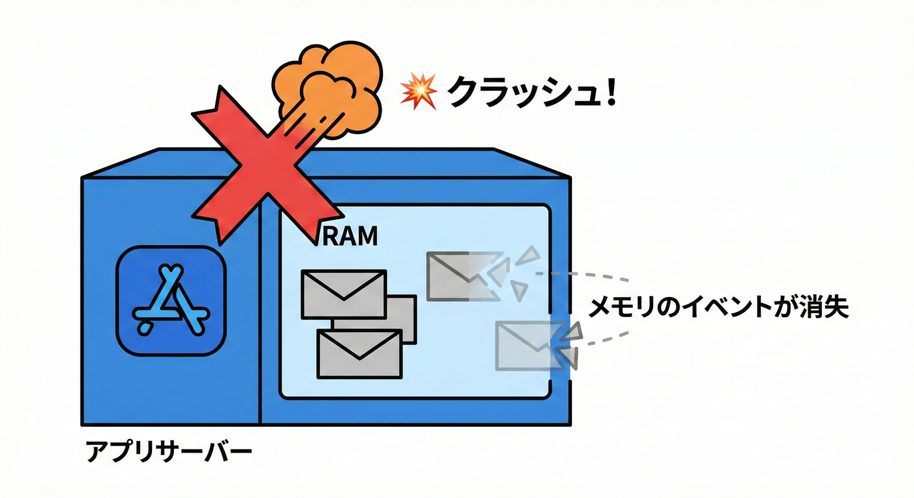
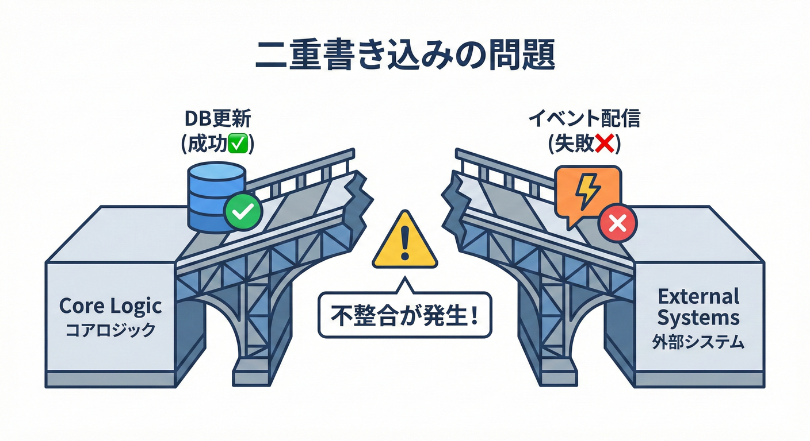

# 第30章 なぜ永続化が必要になる？（取りこぼし問題）😱📦

## この章のゴール🎯✨

この章では、**「インメモリ（メモリ上）でイベント配信してるだけ」だと、運用でどんな事故が起きるか**を体感します🧠💥
そして次章の Outbox（アウトボックス）へつながる **“なぜ必要？”の腹落ち**を作ります🧩🚪

---

## まず復習：いまの仕組み（インメモリ配信）🔔🏠

ここまででやってきたのはだいたいこんな流れ👇✨

1. 集約（Orderなど）が状態変更する（例：支払い完了）💳✅
2. 集約がドメインイベントを **DomainEvents に溜める**📮🧺
3. アプリ層がイベントを拾って、ハンドラに配る📣➡️🎯

この形、学習には最高です🙂💖
でも……運用が始まると「確実に届けたい」欲が出てきて、そこで事故が起こります😇💥

---

## 事故①：アプリが落ちたら、イベントが消える😵‍💫🧯

**インメモリ**＝「メモリにあるだけ」なので、プロセスが止まったら終わりです🫠

### よくある落ち方あるある💥

* アプリ再起動🔁
* デプロイ🚀（新バージョン反映）
* 例外で落ちる💣
* サーバー再起動🪫

この瞬間、**まだ配ってないイベント**は “なかったこと” になります😱📭

---

## 事故②：DBは更新できたのに、イベント側が失敗する（ズレ事故）📌😱

ここが一番つらいポイントです……！

### 例：注文は「支払済」になったのに、メールが飛んでない📧❌

* DB更新：成功✅
* イベント配信（メール送信）：失敗❌（メールサーバー落ちた、タイムアウトした、など）

すると何が起きる？🤔

* 画面では「支払済」になってるのに、ユーザーはメールを受け取れない😢
* サポートに問い合わせが来る📞💦
* じゃあ再送する？でも「どれが未送信？」って判別が難しい😵

**「コミットされた事実」を外に伝えるイベント**（統合イベント）は、永続化が成功した後にだけ起こすべき、という考え方が重要です📜✅ ([Microsoft Learn][1])

---

## 事故③：イベントは飛んだのに、DB更新が失敗する（逆ズレ事故）😱🔁

逆も地獄です🙂（にっこり）

### 例：メール送ったのに、DB保存で例外💾💥

* イベント配信：成功✅（「支払い完了メール送信」）
* DB更新：失敗❌（トランザクション失敗、タイムアウト等）

結果👇

* ユーザーは「支払い完了したんだ！」って思う
* でもDBは未払いのまま
* 二重請求や二重処理の入り口になりがち😱💸

---

## 事故④：サーバーが複数台だと、さらにややこしい🌐😵‍💫

アプリをスケールすると（複数インスタンスで動く）、インメモリ配信はこうなります👇

* Aサーバーのメモリにイベントが溜まる🧠A
* でもBサーバーは知らない🧠B（当然）
* 再起動や負荷分散で「どこで何が起きた？」が見えづらい👀💦

「確実に届けたい」ほど、**メモリだけ**では限界が来ます🚧

---

## なぜこうなる？（原因を一言で）🧠🧷

### 原因はこれ👇

**DBの更新**と**イベント配信**が、別々に成功・失敗するからです😱

これをよく **二重書き込み（dual write）問題**みたいに呼びます💥
「DBに書けた」と「外部に通知できた」を **同時に保証するのが難しい**んですね🧩

---

## “失敗ポイント”を図で理解しよう🗺️🧠

### パターンA：SaveChanges の前に配信📣➡️（危険：逆ズレ）

* メール送信✅
* その後 DB保存で失敗❌
  ➡️ **メール送ったのに未払い**の世界線😱

### パターンB：SaveChanges の後に配信💾➡️📣（危険：ズレ）

* DB保存✅
* その後 メール送信で失敗❌
  ➡️ **支払済なのにメールなし**の世界線😱

どっちにしても事故る可能性が残ります🫠

---

## ミニ実験：わざと事故を起こすコード🧪💥

「DB保存は成功したのに、配信前に落ちる」を再現します😈📌
（※雰囲気のサンプル。EF Coreなどの実装はプロジェクトに合わせてOKです🙂）

```csharp
public async Task MarkOrderAsPaidAsync(OrderId orderId)
{
    var order = await _orderRepository.GetAsync(orderId);

    order.MarkAsPaid(); // ここで OrderPaid を DomainEvents に追加🔔

    await _unitOfWork.SaveChangesAsync(); // ✅ DB保存成功

    // 💥 わざとここで落とす（デプロイ/クラッシュの代わり）
    throw new Exception("クラッシュした！イベント配信前に死んだ！😇");

    // 本来はここでイベント配信したい…
    // await _dispatcher.DispatchAsync(order.DomainEvents);
}
```

### 起きること😱

* DB上の注文：支払済✅
* でもイベント配信：されてない❌
* つまり、メールやポイント付与が “抜ける” 可能性がある📭💦

---

## じゃあどうするの？（答えの方向だけ先に）🧩🚪

ここで登場するのが次章の **Outbox パターン**です🗃️🚚

### 30.1 なぜDBだけでは不十分なのか？😱💥



メモリ上のイベントは、アプリが落ちると消えてしまいます。DB更新だけ成功して、イベントが送られないリスクを学びます。
そうすれば、アプリが落ちても **“未送信の証拠” がDBに残る**ので拾えます🔎✨

* Transactional Outbox は「確実な配信」や「冪等（同じのが来ても安全）」とセットで語られる代表パターンです📦✅ ([Microsoft Learn][2])
* ざっくり言うと「ビジネス更新と同じトランザクション内で、送信予定メッセージも保存する」考え方です🧾🔒 ([microservices.io][3])

---

## ここで超大事：確実性には“重複”が付き物⚠️🔁

永続化して「取りこぼし」を減らすと、今度はこうなりがち👇

* 再送した結果、**同じイベントが2回届く**🔁😇
* だから「何度来ても壊れない（冪等）」が必要になる🧯✨

Transactional Outbox の話でも、冪等な処理が重要テーマとして出てきます📌 ([Microsoft Learn][2])

---

## 30.2 整合性の不一致：Dual Write問題⚖️🧨



DBと外部通知を別々に更新しようとすると、どちらか片方だけが成功して状態がズレてしまう問題です。

* **.NET 10** は **2025/11/11 リリースのLTS**で、サポートは **2028/11/14**まで（アクティブ）です📅✨ ([Microsoft][4])
* **EF Core 10** も **2025年11月リリースのLTS**で、.NET 10 を必要とします🧩💾 ([Microsoft Learn][5])
* Visual Studio は **2026/01/13 時点で 17.14.24 が Current**として案内されています🛠️🪟 ([Microsoft Learn][6])

---

## やってみよう🛠️📝（紙とペンでOK）

次の2ケースで、**「ユーザーに見える問題」**を1行で書いてみてください✍️✨

1. DB保存✅ → イベント配信❌（メール送れない）
2. イベント配信✅ → DB保存❌（メール送ったのに未払い）

さらに余裕があったら👇

* 「運用でどうやって検知する？」🔭
* 「再送するとき、二重にならない？」🔁🧯

---

## チェック✅（この章を終える条件🎓）

* [ ] インメモリだけだと、落ちた瞬間にイベントが消える理由が言える😵‍💫➡️📭
* [ ] 「DB成功・配信失敗」のズレ事故を説明できる✅❌
* [ ] 「配信成功・DB失敗」の逆ズレ事故を説明できる✅❌
* [ ] “確実に届けたい”なら、永続化（Outbox等）が必要になる理由がわかる🗃️🚚

---

## まとめ🎀✨

インメモリ配信は学習には最高だけど、運用では👇が起きます😱

* **取りこぼし**（落ちたら消える）📭
* **ズレ事故**（DBと通知が一致しない）🧩💥
* **重複**（確実性のために再送すると起きがち）🔁⚠️

次章は、この問題に対する定番解として **Outbox** を具体化していきます🗃️🚚✨

[1]: https://learn.microsoft.com/en-us/dotnet/architecture/microservices/microservice-ddd-cqrs-patterns/domain-events-design-implementation?utm_source=chatgpt.com "Domain events: Design and implementation - .NET"
[2]: https://learn.microsoft.com/en-us/azure/architecture/databases/guide/transactional-outbox-cosmos?utm_source=chatgpt.com "Transactional Outbox pattern with Azure Cosmos DB"
[3]: https://microservices.io/patterns/data/transactional-outbox.html?utm_source=chatgpt.com "Pattern: Transactional outbox"
[4]: https://dotnet.microsoft.com/ja-jp/platform/support/policy?utm_source=chatgpt.com "公式の .NET サポート ポリシー | .NET"
[5]: https://learn.microsoft.com/en-us/ef/core/what-is-new/ef-core-10.0/whatsnew?utm_source=chatgpt.com "What's New in EF Core 10"
[6]: https://learn.microsoft.com/en-us/visualstudio/releases/2022/release-history?utm_source=chatgpt.com "Visual Studio 2022 Release History"
