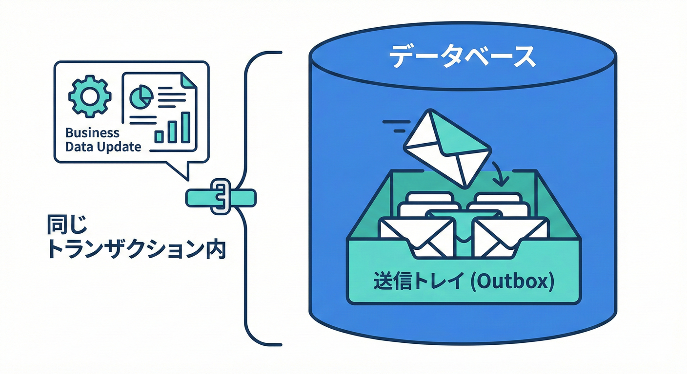
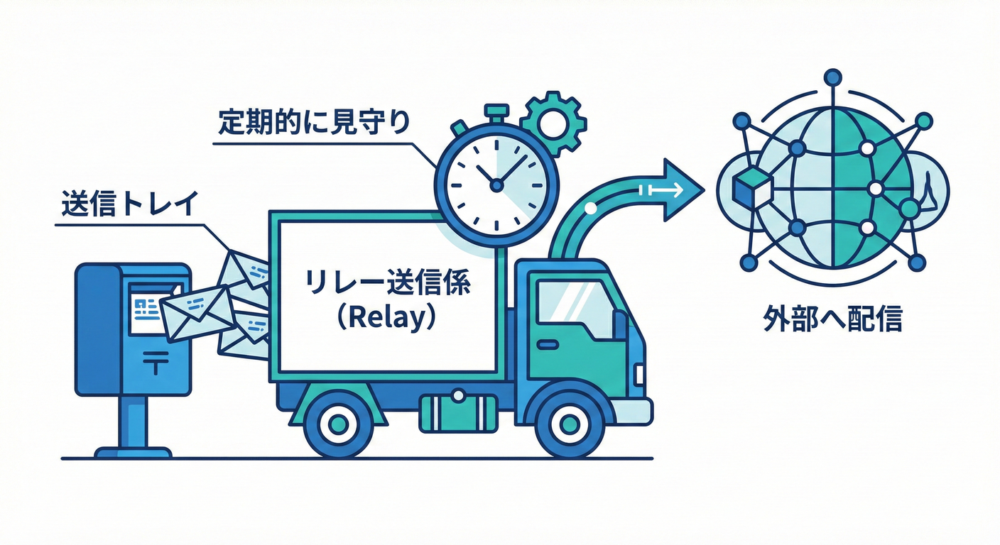

# 第31章 Outbox入門：DBに書いて後で送る🗃️🚚

## 31.1 ねらい🎯

ドメインイベントを「取りこぼさずに届ける」ための定番パターン **Outbox（送信トレイ）** を、実装イメージまでセットで理解します😊✨
（“DB更新✅なのにイベント送信❌” みたいなズレ事故を減らすやつです！）

---

## 31.2 Outboxってなに？🧩

**Outboxパターン**は、ざっくり言うとこう👇

* まず **DBの同じトランザクション**で
  ✅ 業務データ更新（例：注文を支払済みにする）
  ✅ Outboxテーブルに「送る予定のイベント」を書く
* その後、別の処理（バックグラウンドなど）が
  🔁 Outboxテーブルを見て
  📣 メッセージブローカー等へ送って
  ✅ “送った印” を付ける

「更新」と「送る予定の記録」を **同時に確定**させるのがキモです💡
この考え方は .NET のマイクロサービス設計ガイドでも触れられてます。 ([Microsoft Learn][1])
パターンの定義としては microservices.io の “Transactional outbox” が分かりやすいです。 ([microservices.io][2])

---

## 31.3 どんな事故を防ぐの？😱（Dual Write問題）

第30章で出てきた「ズレ事故」の正体はこれ👇

### 事故A：DB更新してから送る直前に落ちる💥

1. DB更新（支払済）✅
2. イベント送信（まだ）
3. アプリがクラッシュ💥
   → **DBだけ更新されて、イベントが消える**😵‍💫

### 事故B：DB更新は成功、送信だけ失敗📡

1. DB更新✅
2. ネットワーク一瞬死んで送信失敗❌
   → **送るべきイベントが行方不明**😵‍💫

Outboxはこれを「まずDBに送信予定を残す」ことで回避します✅ ([microservices.io][2])

---

## 31.4 全体の流れ（まず絵で理解）🗺️✨

### ✅ 1) アプリの主処理（同期）



* 注文を支払済みにする（集約の状態が変わる）
* ドメインイベント `OrderPaid` が発生🔔
* `SaveChanges` で

  * Ordersテーブル更新✅
  * Outboxテーブルにイベント行を追加✅
    を **同一トランザクションでコミット**🧷

### 🔁 2) 送信係（非同期）

* 未送信のOutbox行を拾う
* 外部へ送信（Kafka / RabbitMQ / Service Bus など）📣
* 成功したら `ProcessedAt` を更新✅
* 失敗したら `Attempts` を増やしてリトライ🔁

この「更新とOutbox書き込みを同時に確定する」考え方は、Microsoftの解説（Outboxの位置づけ）でも一貫してます。 ([Microsoft Learn][1])

---

## 31.5 Outboxテーブル設計：まずは最小でOK🧾✨

まずは “最低限これ” セットでOKです😊

* `Id`（GUID）🪪 … **イベントの一意ID**
* `Type`（string）🏷️ … 例：`OrderPaid`
* `Payload`（json）📦 … 送る中身（必要最小限！）
* `OccurredAt`（datetime）🕒 … 起きた時刻
* `ProcessedAt`（datetime?）✅ … 送れた時刻（nullなら未送信）

運用を考えるなら、追加でおすすめ👇

* `Attempts`（int）🔁 … リトライ回数
* `LastError`（string?）💥 … 最後のエラー
* `NextAttemptAt`（datetime?）⏭️ … 次に試す時刻（バックオフ用）
* `CorrelationId`（string?）🧵 … ログ追跡用（第26章の観測と相性◎）

> ⚠️ Payloadは「巨大なモデル丸ごと」じゃなくて
> **集約ID＋業務的に必要な値だけ**に絞るのが安全です（第17章の復習）📦✂️

---

## 31.6 超重要：Outboxでも“重複”は起きるよ⚠️（だから冪等性）

Outboxは「取りこぼし」を減らす強い味方だけど、**基本は at-least-once（少なくとも1回）**になりやすいです🙂
つまり…

* 送信成功したのに、`ProcessedAt` 更新前に落ちた💥
  → 次回また送ってしまう（重複）😇

だから受け手側（または送信側の仕組み）で、次のどっちかが必要👇

* **冪等（べきとう）**：同じイベントを2回受けても結果が同じ✅
* **重複排除（Dedup）**：イベントIDを保存して二重処理しない✅

この“確実に届ける”設計は Dapr のOutbox解説でも「通知の信頼性」とセットで語られます。 ([Dapr Docs][3])

---

## 31.7 C#実装（学習用の手書きOutbox）🛠️✨

ここでは **.NET 10 / EF Core 10** 前提の形で、最小構成を作ります✅
（.NET 10 と EF Core 10 は 2025年11月リリースのLTSです） ([Microsoft for Developers][4])

### 31.7.1 Outboxエンティティ📦

```csharp
public sealed class OutboxMessage
{
    public Guid Id { get; init; } = Guid.NewGuid();
    public required string Type { get; init; }          // 例: "OrderPaid"
    public required string Payload { get; init; }       // JSON
    public DateTimeOffset OccurredAt { get; init; }     // 発生時刻(UTC推奨)

    public DateTimeOffset? ProcessedAt { get; set; }    // 送信済みなら時刻
    public int Attempts { get; set; }                   // 失敗回数
    public string? LastError { get; set; }
    public DateTimeOffset? NextAttemptAt { get; set; }  // バックオフ用（任意）
}
```

### 31.7.2 SaveChangesのタイミングでOutboxへ積む（Interceptor）🧲

「ドメインイベントを溜める」（第19章）→「SaveChangesで回収してOutbox行を追加」
これが王道です💡
EF Core では `SaveChangesInterceptor` を使う例がよく紹介されます。 ([DEV Community][5])

```csharp
using System.Text.Json;
using Microsoft.EntityFrameworkCore;
using Microsoft.EntityFrameworkCore.Diagnostics;

public sealed class OutboxSaveChangesInterceptor : SaveChangesInterceptor
{
    public override ValueTask<InterceptionResult<int>> SavingChangesAsync(
        DbContextEventData eventData,
        InterceptionResult<int> result,
        CancellationToken cancellationToken = default)
    {
        var db = eventData.Context;
        if (db is null) return base.SavingChangesAsync(eventData, result, cancellationToken);

        // 例: 集約ルートが DomainEvents を持っている想定（第19章）
        var aggregates = db.ChangeTracker.Entries<IHasDomainEvents>()
            .Select(e => e.Entity)
            .ToList();

        var domainEvents = aggregates.SelectMany(a => a.DomainEvents).ToList();
        if (domainEvents.Count == 0) return base.SavingChangesAsync(eventData, result, cancellationToken);

        foreach (var ev in domainEvents)
        {
            var message = new OutboxMessage
            {
                Type = ev.GetType().Name,
                Payload = JsonSerializer.Serialize(ev, ev.GetType()),
                OccurredAt = ev.OccurredAt
            };
            db.Set<OutboxMessage>().Add(message);
        }

        // 配ったら掃除🧹（第19章のチェック項目）
        foreach (var a in aggregates) a.ClearDomainEvents();

        return base.SavingChangesAsync(eventData, result, cancellationToken);
    }
}

public interface IHasDomainEvents
{
    IReadOnlyCollection<IDomainEvent> DomainEvents { get; }
    void ClearDomainEvents();
}

public interface IDomainEvent
{
    DateTimeOffset OccurredAt { get; }
}
```

> 💡ここでのポイント
>
> * **Outbox行追加も SaveChanges の一部**になるので、同一トランザクションで確定しやすい✅
> * 「DB更新✅だけ成功、Outbox追加❌」みたいなズレが起きにくい✅

### 31.7.3 Dispatcher（送信係）をBackgroundServiceで作る🔁🚚



```csharp
using Microsoft.EntityFrameworkCore;
using Microsoft.Extensions.Hosting;

public interface IIntegrationEventPublisher
{
    Task PublishAsync(string type, string payload, CancellationToken ct);
}

public sealed class OutboxDispatcher : BackgroundService
{
    private readonly IDbContextFactory<AppDbContext> _dbFactory;
    private readonly IIntegrationEventPublisher _publisher;

    public OutboxDispatcher(IDbContextFactory<AppDbContext> dbFactory, IIntegrationEventPublisher publisher)
    {
        _dbFactory = dbFactory;
        _publisher = publisher;
    }

    protected override async Task ExecuteAsync(CancellationToken stoppingToken)
    {
        while (!stoppingToken.IsCancellationRequested)
        {
            await DispatchOnce(stoppingToken);
            await Task.Delay(TimeSpan.FromSeconds(1), stoppingToken); // まずは1秒間隔でOK🙂
        }
    }

    private async Task DispatchOnce(CancellationToken ct)
    {
        await using var db = await _dbFactory.CreateDbContextAsync(ct);

        var now = DateTimeOffset.UtcNow;
        var batch = await db.OutboxMessages
            .Where(x => x.ProcessedAt == null && (x.NextAttemptAt == null || x.NextAttemptAt <= now))
            .OrderBy(x => x.OccurredAt)
            .Take(50)
            .ToListAsync(ct);

        if (batch.Count == 0) return;

        foreach (var msg in batch)
        {
            try
            {
                await _publisher.PublishAsync(msg.Type, msg.Payload, ct);

                msg.ProcessedAt = DateTimeOffset.UtcNow;
                msg.LastError = null;
                msg.NextAttemptAt = null;
            }
            catch (Exception ex)
            {
                msg.Attempts++;
                msg.LastError = ex.Message;

                // 雑にバックオフ（学習用）
                var wait = TimeSpan.FromSeconds(Math.Min(60, Math.Pow(2, msg.Attempts)));
                msg.NextAttemptAt = DateTimeOffset.UtcNow.Add(wait);
            }
        }

        await db.SaveChangesAsync(ct);
    }
}
```

### 31.7.4 Publisherはインターフェースで隠す🎭

学習用は “ログに出すだけ” でOK😊（あとでRabbitMQ等に差し替え可能✨）

```csharp
public sealed class LogPublisher : IIntegrationEventPublisher
{
    private readonly ILogger<LogPublisher> _logger;

    public LogPublisher(ILogger<LogPublisher> logger) => _logger = logger;

    public Task PublishAsync(string type, string payload, CancellationToken ct)
    {
        _logger.LogInformation("📣 Publish {Type} {Payload}", type, payload);
        return Task.CompletedTask;
    }
}
```

---

## 31.8 複数台で動かす時の注意（ちょい発展）🧠⚙️

アプリを2台、3台…と増やしてDispatcherも複数動くと、同じOutbox行を取り合う問題が出ます😵‍💫
このときは「行の取り合いを防ぐ」仕組みが必要です。

よくある作戦👇

* **DBのロックを使って“この行は私が処理中”を確保する**
  例：PostgreSQL なら `SELECT ... FOR UPDATE SKIP LOCKED` みたいなやつ（高スループット向け） ([milanjovanovic.tech][6])
* あるいは「Leaderだけ動かす」方式（DBロックでリーダー選出など）もあります🔐 ([The Shade Tree Developer][7])

この教材ではまず1台運用を前提にしてOKです🙂✨（理解が最優先！）

---

## 31.9 監視（オブザーバビリティ）もセットで！🔭✨

Outboxを入れたら、見るべき指標はこの3つが最重要です👇

* **未送信件数**（`ProcessedAt is null` の数）📦
* **遅延**（`now - OccurredAt` の最大/平均）⏱️
* **失敗率**（Attempts増加、LastError発生）💥

アラート例🚨

* 未送信が一定数を超えた
* 遅延が5分を超えた
* 失敗が連続した（poisonメッセージ疑い）

---

## 31.10 やってみよう🛠️（ミニECでOutbox体験🛒💳📦）

### ステップ1：Outboxテーブルを追加🧾

* `OutboxMessages` を作る
* `ProcessedAt` にインデックス（未送信検索が速くなる）🏎️💨

### ステップ2：Interceptorで自動で積む🧲

* `Order.MarkAsPaid()` で `OrderPaid` を溜める（第19章の形）
* `SaveChanges` で Outbox に行が入るのを確認👀✨

### ステップ3：わざと落としてみる💥（超だいじ！）

* `SaveChanges` のあと、送信前に例外を投げてクラッシュさせる
* 再起動後、Dispatcher が Outbox から拾って送れるのを確認✅✨

---

## 31.11 AI拡張の使いどころ🤖💡（便利だけど安全に！）

おすすめの使い方👇

* Outboxテーブルの **列案** を出してもらう（ただし採用は自分で判断）🧾
* `SaveChangesInterceptor` の雛形生成🧲
* “重複排除” の設計案（受け手の冪等性）をレビューしてもらう🧠

チェック✅

* 「なぜこの列が必要？」を説明できる？🙂
* 「重複が起きたらどうなる？」を説明できる？🙂

---

## 31.12 チェック✅（理解できたかクイズ🎀）

* Q1：Outboxは「何と何を同時に確定」させるためのパターン？🧩
* Q2：Outboxを入れても“重複”が起こりうるのはなぜ？🔁
* Q3：未送信が溜まってるのを検知するには、どんな指標を見る？🔭

---

## 31.13 まとめ📌✨

* Outboxは「DB更新✅」と「送信予定の記録✅」を同じ確定に入れて、取りこぼしを減らす定番パターン🗃️🚚 ([microservices.io][2])
* ただし“重複”は起きうるので、冪等性/重複排除とセットで考える🙂⚠️ ([Dapr Docs][3])
* 実装は **Outboxテーブル + Interceptor + Dispatcher** の3点セットでまずOK🧩
* 監視（未送信数・遅延・失敗）までやって初めて「運用で強い」になる🔭✨

[1]: https://learn.microsoft.com/en-us/dotnet/architecture/microservices/architect-microservice-container-applications/asynchronous-message-based-communication?utm_source=chatgpt.com "Asynchronous message-based communication - .NET"
[2]: https://microservices.io/patterns/data/transactional-outbox.html?utm_source=chatgpt.com "Pattern: Transactional outbox"
[3]: https://docs.dapr.io/developing-applications/building-blocks/state-management/howto-outbox/?utm_source=chatgpt.com "How-To: Enable the transactional outbox pattern"
[4]: https://devblogs.microsoft.com/dotnet/announcing-dotnet-10/?utm_source=chatgpt.com "Announcing .NET 10"
[5]: https://dev.to/stevsharp/reliable-messaging-in-net-domain-events-and-the-outbox-pattern-with-ef-core-interceptors-pjp?utm_source=chatgpt.com "Domain Events and the Outbox Pattern with EF Core ..."
[6]: https://www.milanjovanovic.tech/blog/implementing-the-outbox-pattern?utm_source=chatgpt.com "Implementing the Outbox Pattern"
[7]: https://jeremydmiller.com/2020/05/05/using-postgresql-advisory-locks-for-leader-election/?utm_source=chatgpt.com "Using Postgresql Advisory Locks for Leader Election"
