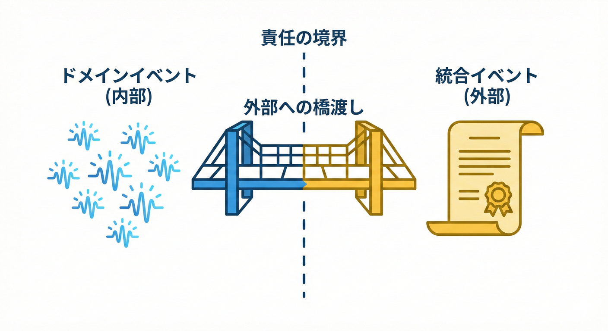
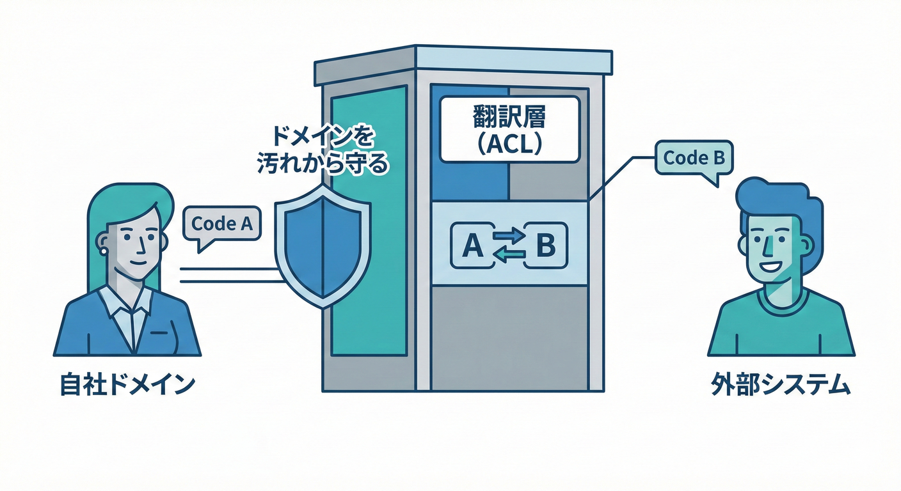
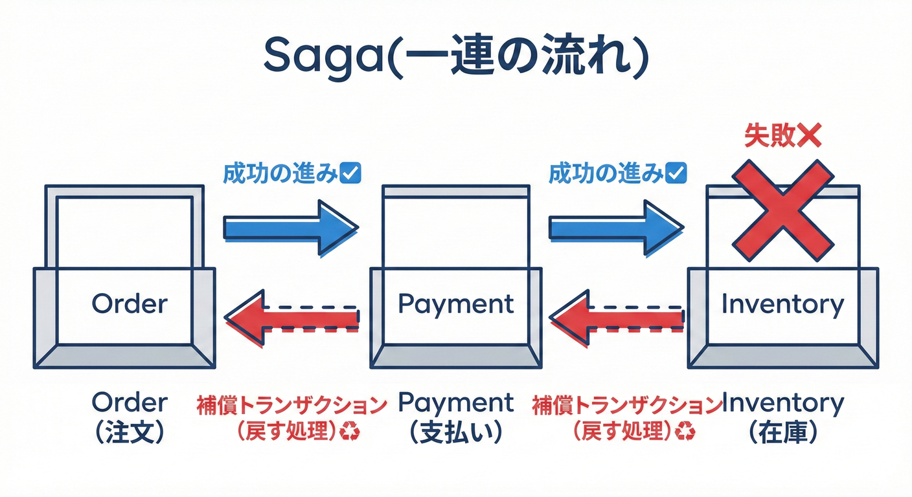

# 第32章 外部公開と次の一歩：統合イベント・ACL・契約・Sagaの入口🌍📜🔗

## 0. この章でわかること🎓✨

* **ドメインイベント（内部）** と **統合イベント（外部）** を、ちゃんと別物として扱えるようになる🔔📨
* 外部に出すときに必要な **「契約」**（壊さず進化させるルール）を持てる📜✅
* 外部の“クセ”をドメインに持ち込まない **ACL（翻訳層）** が作れる🧼🛡️
* 分散した複数ステップの整合性を扱う **Saga（補償付きの流れ）** の入口がつかめる♻️🧩

---

## 1. まず結論：外に出すなら「ドメインイベントをそのまま出さない」🙅‍♀️📤

### ドメインイベント（Domain Event）❤️🔔



* **自分の境界（Bounded Context）の中だけ** で通じる「起きた事実」
* 目的：**モデルの中の変化**を表す（＝設計の中心）
* 実装：同一プロセス内のディスパッチ（in-memory）になりがち ([Microsoft Learn][1])

### 統合イベント（Integration Event）🌍📨

* **境界の外**（別サービス・別システム・分析基盤・パートナー）へ「知らせる」ためのイベント
* 目的：**外部と疎結合でつながる**
* 実装：メッセージブローカー（Queue/Topic/EventBus）で非同期になりがち ([Microsoft Learn][2])

✅ ここが超大事：
**ドメインイベントは“自分用の言葉”**、**統合イベントは“外部と約束する言葉（契約）”** 📜✨
（同じ「イベント」でも、責任が違うの！）

---

## 2. 「契約」ってなに？📜✨（＝壊さず進化させるルール）

外に公開するイベントは、もう **あなたの都合で自由に変えられない** 😭
だから **契約（Contract）** を決めるよ！

### 契約に含めたい最小セット🧾

* **イベント名（Type）**：例 `order.payment.completed`
* **イベントID**：重複検知に使う（後で大助かり）🆔
* **発生時刻**：ログ・追跡に必須🕒
* **バージョン**：将来の変更に備える（後述）🔁
* **Payload（Data）**：必要最小限だけ📦✂️

> 💡「外部が知りたいこと」だけを載せる。
> “内部の都合”や“巨大なモデル丸ごと”は載せない🙅‍♀️🐘

### CloudEvents って？（イベントの共通フォーマット）☁️📦

クラウドやプラットフォームをまたいでイベントを扱いやすくするための仕様だよ📏✨
「id」「type」「source」「time」など、共通の“封筒”を定義してくれる感じ📩
([GitHub][3])

（必須じゃないけど、統合が増えるほど便利になりがち👍）

---

## 3. ACL（Anti-Corruption Layer）＝“翻訳係”🧼🛡️



外部とつなぐと、だいたいこうなる👇

* 外部のデータ形式が変💦（命名も粒度も違う）
* 外部の概念がドメインに混ざると、ドメインが汚れる😵‍💫

そこで **ACL（翻訳層）** を置く！

### ACLの役割🎀

* **ドメインの言葉 ↔ 外部の言葉** を翻訳する
* 外部の変更が来ても、**ドメイン全体に波及しない**
  ([Microsoft Learn][4])

---

## 4. Outbox（前章）とセットで覚える：外部公開の定石🗃️🚚

「DB更新は成功✅、でもイベント送信が失敗❌」みたいなズレ事故を減らす定番が **Transactional Outbox** だよ📦✨
([Microsoft Learn][5])

ざっくり流れはこう👇

1. ドメインイベント発生🔔
2. アプリ層で **統合イベントに変換** 🧼（ACL/Mapper）
3. DBトランザクション内で **Outboxに保存** 🗃️
4. 別プロセス/HostedServiceが **Outboxを送信** 🚚📨
5. 送信済みをマーク✅

---

## 5. “壊さず進化”させる：バージョニングの考え方🔁📜

### 5-1. よくある2つの作戦🎮

**A) バージョンをイベント名に入れる**

* `order.payment.completed.v1` → `...v2`
* ルーティングや運用でわかりやすい👍

**B) 同じイベント名で、schemaVersionを持つ**

* `type = order.payment.completed`
* `schemaVersion = 1`（payload内 or ヘッダ）

どっちでもOK。大事なのは **“互換性ルール”** を決めること✨

### 5-2. 互換性の超ざっくりルール✅

* **追加はしやすい**：新しいフィールドを「任意」で追加🧩
* **削除・意味変更は危険**：既存の利用者が壊れる💥
* **型変更は原則NG**：`int`→`string` とか地獄👹

---

## 6. 現実：統合イベントは「重複」して届く前提📨📨📨（だから冪等性！）

多くのメッセージングは **at-least-once（最低1回、たまに重複）** が現実的。
だから受信側は **冪等（同じイベントを2回処理しても結果が同じ）** にするのが鉄板✅

### 最小のやり方：Inbox（処理済みID）🧾🧹

* `ProcessedMessageIds` テーブル（or キャッシュ）に **イベントID** を保存
* すでに処理済みならスキップ👋

---

## 7. Saga（サガ）入門：複数サービスにまたがる“長い処理”♻️🧩

* 途中で失敗したら、**補償トランザクション**で戻す（例：返金、在庫戻し）♻️
  ([Microsoft Learn][6])



### ミニECで例えると🛒📦

1. 注文確定✅（Order）
2. 決済確保✅（Payment）
3. 在庫引当✅（Inventory）
4. 配送手配✅（Shipping）

もし 3) 在庫引当が失敗したら…

* 2) を **返金（補償）** 💸
* 1. を **キャンセル（補償）** 🧾

「全部を1個の巨大トランザクションにしない」代わりに、
**戻す手順（補償）も設計する**って感じだよ✨ ([Microsoft Learn][6])

---

## 8. やってみよう🛠️：内部イベント → 外部イベントへ変換してOutboxへ📮🧺

題材：

* 内部：`OrderPaid`（ドメインイベント）❤️🔔
* 外部：`OrderPaymentCompletedV1`（統合イベント）🌍📨

### 8-1. ドメインイベント（内部）🔔

```csharp
public interface IDomainEvent
{
    DateTimeOffset OccurredAt { get; }
}

public sealed record OrderPaid(
    Guid OrderId,
    decimal Amount,
    string Currency,
    DateTimeOffset OccurredAt
) : IDomainEvent;
```

✅ 内部イベントなので、ドメインが扱いやすい形でOK。
（ただし巨大化はさせないのが吉📦✂️）

### 8-2. 統合イベント（外部契約）📜

```csharp
public interface IIntegrationEvent
{
    Guid EventId { get; }
    string Type { get; }          // 契約上の名前
    int SchemaVersion { get; }    // 例: 1
    DateTimeOffset Time { get; }  // 発生時刻
}

public sealed record OrderPaymentCompletedV1(
    Guid EventId,
    Guid OrderId,
    decimal PaidAmount,
    string Currency,
    DateTimeOffset Time,
    int SchemaVersion = 1
) : IIntegrationEvent
{
    public string Type => "order.payment.completed";
}
```

ポイント💡

* **EventId** を必ず持つ（重複対策の核）🆔
* `Type` は外部契約。内部のクラス名と一致しなくてOK🙆‍♀️
* `SchemaVersion` は“進化”のための保険🔁

### 8-3. ACL/Mapper（翻訳係）🧼

```csharp
public static class IntegrationEventMapper
{
    public static OrderPaymentCompletedV1 ToIntegrationEvent(OrderPaid domainEvent)
        => new(
            EventId: Guid.NewGuid(),
            OrderId: domainEvent.OrderId,
            PaidAmount: domainEvent.Amount,
            Currency: domainEvent.Currency,
            Time: domainEvent.OccurredAt
        );
}
```

✅ ここがACLの“超ミニ版”。
外部都合が増えたら、この層がどんどん価値を出すよ🛡️✨

### 8-4. Outboxへ保存（送信は後で）🗃️

```csharp
public sealed class OutboxMessage
{
    public Guid Id { get; init; }
    public string Type { get; init; } = "";
    public int SchemaVersion { get; init; }
    public string PayloadJson { get; init; } = "";
    public DateTimeOffset OccurredAt { get; init; }
}

public static class OutboxWriter
{
    public static OutboxMessage ToOutboxMessage(IIntegrationEvent ev)
        => new()
        {
            Id = ev.EventId,
            Type = ev.Type,
            SchemaVersion = ev.SchemaVersion,
            OccurredAt = ev.Time,
            PayloadJson = System.Text.Json.JsonSerializer.Serialize(ev)
        };
}
```

✅ 送信処理（Service Bus / RabbitMQ / Kafka など）は、この章では **“外側の実装”**。
「Outboxに確実に入った」ことが、まず勝ち🏁

---

## 9. やってみよう🛠️：Sagaを“紙に”設計してみる📝♻️

### 9-1. Sagaの設計テンプレ（超実用）📋✨

* **目的**：何を最終的に達成したい？🎯
* **ステップ**：どの順番で何をする？🔁
* **各ステップの成功条件**：何が確認できたら成功？✅
* **失敗時の補償**：失敗したら何で戻す？♻️
* **状態**：今どこまで進んだ？（状態機械っぽく）🚦

例（超ざっくり）🛒

* Start：OrderPlaced
* Step1：PaymentAuthorized（失敗→OrderCanceled）
* Step2：InventoryReserved（失敗→PaymentRefunded → OrderCanceled）
* Step3：ShipmentCreated（失敗→InventoryReleased → PaymentRefunded → OrderCanceled）

この「補償の列」を書けるだけで、設計レベルが一気に上がるよ📈✨ ([Microsoft Learn][6])

---

## 10. AI活用プロンプト例🤖💡（そのままコピペOK）

* 「`order.payment.completed` の統合イベント契約を、壊さず進化させるためのバージョニング方針を3案ください。互換性ルールもセットで」
* 「外部決済APIの `settled/paid/authorized` を、ドメインの `PaymentStatus` に翻訳するACL設計を提案して。変換テーブル案も」
* 「注文→決済→在庫→配送のSagaを、失敗パターン別に補償トランザクション付きで表にして」

---

## 11. チェック✅（この章のゴール判定🎀）

* [ ] 内部イベントと外部イベントを **分けて説明**できる ([Microsoft Learn][1])
* [ ] 外部公開イベントに **EventId / Type / Version / Time** を入れた📨
* [ ] 外部のクセは **ACLで吸収**する設計にした ([Microsoft Learn][4])
* [ ] Outboxに保存してから送る流れを描ける ([Microsoft Learn][5])
* [ ] Sagaで **補償トランザクション**を言語化できる ([Microsoft Learn][6])

---

## 12. よくある事故あるある😇💥（先に潰そ！）

* **ドメインイベントをそのまま外部に流す** → 後から内部変更できず地獄📛
* **イベントにモデル丸ごと入れる** → 依存が増えて破綻🐘💦
* **バージョンなし** → 変更が来た瞬間に全員が困る🧨
* **重複対策なし** → 二重課金・二重付与・二重メール📨📨📨
* **Sagaの補償を考えない** → “途中まで成功”のまま取り残される😱

---

## 付録：2026年時点のC#/.NETの目安📌🪟

* **.NET 10** は **2025-11-11** にリリース、LTSで **2028-11-14** までサポート、最新パッチは **10.0.2（2026-01-13）** ([Microsoft][7])
* **C# 14** は **2025年11月リリース**で、**.NET 10 以降でサポート** ([Microsoft Learn][8])

[1]: https://learn.microsoft.com/en-us/dotnet/architecture/microservices/microservice-ddd-cqrs-patterns/domain-events-design-implementation?utm_source=chatgpt.com "Domain events: Design and implementation - .NET"
[2]: https://learn.microsoft.com/en-us/dotnet/architecture/microservices/multi-container-microservice-net-applications/integration-event-based-microservice-communications?utm_source=chatgpt.com "Implementing event-based communication between ..."
[3]: https://github.com/cloudevents/spec?utm_source=chatgpt.com "CloudEvents Specification"
[4]: https://learn.microsoft.com/en-us/azure/architecture/patterns/anti-corruption-layer?utm_source=chatgpt.com "Anti-corruption Layer pattern - Azure Architecture Center"
[5]: https://learn.microsoft.com/en-us/azure/architecture/databases/guide/transactional-outbox-cosmos?utm_source=chatgpt.com "Transactional Outbox pattern with Azure Cosmos DB"
[6]: https://learn.microsoft.com/en-us/azure/architecture/patterns/saga?utm_source=chatgpt.com "Saga Design Pattern - Azure Architecture Center"
[7]: https://dotnet.microsoft.com/en-us/platform/support/policy/dotnet-core ".NET and .NET Core official support policy | .NET"
[8]: https://learn.microsoft.com/en-us/dotnet/csharp/whats-new/csharp-version-history "The history of C# | Microsoft Learn"
