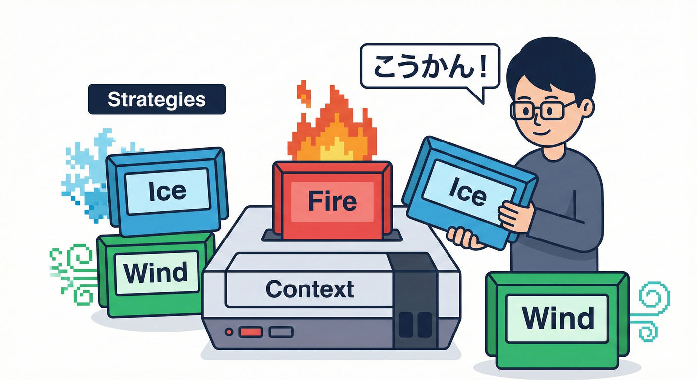

# 第33章：分岐をStrategyへ（多態性の入口）🧠🧩

---

## 1. 今日のゴール🎯✨



「if / switch の分岐が増え続けてツラい…😵‍💫」を、**Strategy（ストラテジー）パターン**でスッキリさせます🌿
やることはシンプル👇

* 分岐の“中身”を、**別クラスに引っ越し**🏠✨
* 呼び出し側は「どれ使う？」だけを決める🎛️
* 追加が来ても、**既存コードを壊しにくい**✅

※ちなみにC# 14 / .NET 10 / Visual Studio 2026 の最新環境でも、このやり方はそのまま王道で使えます💻🌟 ([Microsoft Learn][1])

---

## 2. Strategyってなに？🍰

Strategyは一言でいうと👇

> 「やり方（アルゴリズム）を、差し替え可能な部品に分ける」🧩

つまり…

* **分岐が増える**（機能追加が頻繁）
* **分岐ごとに処理が長い**
* **テストがしづらい**（分岐の中がゴチャゴチャ）

こういう時に、分岐を「クラス」にして分離します✂️✨

---

## 3. まずは“やりすぎない判断”⚖️🙂

### switch/if のままでOKなとき👌

* 分岐が **2〜3個**くらいで、今後増えなさそう
* 分岐の中身が **短い**（数行で終わる）
* ルールが超固定（増えない・変わらない）

C# のパターンマッチや switch 式は読みやすいので、小規模なら全然アリです🙂✨ ([Microsoft Learn][2])

### Strategyにした方がいいサイン🚨

* 分岐が **4個以上**で、今後も増える予感😇
* 分岐の中に **別の分岐**が入ってカオス🌪️
* 仕様追加のたびに **同じメソッド**を編集してる✍️💦
* 「この分岐だけテストしたい」がやりづらい🧪

---

## 4. 例題：送料計算が増え続ける📦🚚💦

### Before（分岐地獄）😵‍💫

送料が「通常 / 冷凍 / 特大」みたいに増えてきたパターンです。

```csharp
public enum ShippingType
{
    Normal,
    Frozen,
    Oversize
}

public sealed class ShippingService
{
    public decimal CalculateFee(ShippingType type, decimal weightKg, bool isRemoteArea)
    {
        decimal fee;

        switch (type)
        {
            case ShippingType.Normal:
                fee = 500m + weightKg * 80m;
                break;

            case ShippingType.Frozen:
                fee = 800m + weightKg * 100m;
                break;

            case ShippingType.Oversize:
                fee = 1200m + weightKg * 150m;
                break;

            default:
                throw new ArgumentOutOfRangeException(nameof(type));
        }

        if (isRemoteArea)
        {
            fee += 400m;
        }

        return fee;
    }
}
```

見た目はまだ平和だけど、だんだんこうなります👇

* 「条件追加（地域割引、キャンペーン…）」
* 「種類追加（大型冷凍…）」
* 「例外ルール（離島だけ別計算…）」

そして `CalculateFee` が伸びていく📈😇

---

## 5. 安全のために、先にテストで挙動を固定📸🧪

リファクタの鉄板はこれ👇
**“今の動作をテストで固定してから”触る**✅

```csharp
using Xunit;

public sealed class ShippingServiceTests
{
    [Theory]
    [InlineData(ShippingType.Normal, 2.0, false, 500 + 2.0 * 80)]
    [InlineData(ShippingType.Frozen, 1.5, true, 800 + 1.5 * 100 + 400)]
    [InlineData(ShippingType.Oversize, 3.0, false, 1200 + 3.0 * 150)]
    public void CalculateFee_returns_expected_fee(
        ShippingType type, double weightKg, bool remote, double expected)
    {
        var sut = new ShippingService();

        var actual = sut.CalculateFee(type, (decimal)weightKg, remote);

        Assert.Equal((decimal)expected, actual);
    }
}
```

ポイント📝✨

* まずは **代表ケース**だけでOK🙆‍♀️
* 仕様追加が多いところほど、テストが効きます🧪💕

---

## 6. Strategy化：設計の形を作る🧩🏗️

### Step 1：Strategyのインターフェースを作る🎀

「送料の計算方法」を部品にします。

```csharp
public interface IShippingFeeStrategy
{
    ShippingType Type { get; }
    decimal Calculate(decimal weightKg, bool isRemoteArea);
}
```

### Step 2：分岐ごとのクラスに分ける🏠🏠🏠

```csharp
public sealed class NormalShippingFeeStrategy : IShippingFeeStrategy
{
    public ShippingType Type => ShippingType.Normal;

    public decimal Calculate(decimal weightKg, bool isRemoteArea)
    {
        var fee = 500m + weightKg * 80m;
        if (isRemoteArea) fee += 400m;
        return fee;
    }
}

public sealed class FrozenShippingFeeStrategy : IShippingFeeStrategy
{
    public ShippingType Type => ShippingType.Frozen;

    public decimal Calculate(decimal weightKg, bool isRemoteArea)
    {
        var fee = 800m + weightKg * 100m;
        if (isRemoteArea) fee += 400m;
        return fee;
    }
}

public sealed class OversizeShippingFeeStrategy : IShippingFeeStrategy
{
    public ShippingType Type => ShippingType.Oversize;

    public decimal Calculate(decimal weightKg, bool isRemoteArea)
    {
        var fee = 1200m + weightKg * 150m;
        if (isRemoteArea) fee += 400m;
        return fee;
    }
}
```

ここまでで「分岐の中身」は引っ越し完了🚚✨

---

## 7. どのStrategyを使うか？（選び方が重要）🎛️🧠

選び方は2つの定番があります👇

### A. いちばん簡単：Dictionaryで選ぶ🗂️✨（おすすめ入門）

```csharp
public sealed class ShippingService
{
    private readonly IReadOnlyDictionary<ShippingType, IShippingFeeStrategy> _map;

    public ShippingService(IEnumerable<IShippingFeeStrategy> strategies)
    {
        _map = strategies.ToDictionary(x => x.Type);
    }

    public decimal CalculateFee(ShippingType type, decimal weightKg, bool isRemoteArea)
    {
        var strategy = _map[type];
        return strategy.Calculate(weightKg, isRemoteArea);
    }
}
```

* 呼び出し側がスッキリ🌿
* 分岐追加は **Strategyを1個足すだけ**➕✨

### B. DI（依存性注入）で集める🧩🔁（Web/アプリでも超定番）

DIは「interfaceで抽象化して、必要な実装を注入する」考え方です💡
.NETのDIの基本もこの形を推しています🧠✨ ([Microsoft Learn][3])

---

## 8. （おまけ）DI登録イメージ🧃🤖

ConsoleでもWebでも発想は同じです👇

```csharp
// Program.cs など（例）
services.AddSingleton<IShippingFeeStrategy, NormalShippingFeeStrategy>();
services.AddSingleton<IShippingFeeStrategy, FrozenShippingFeeStrategy>();
services.AddSingleton<IShippingFeeStrategy, OversizeShippingFeeStrategy>();

services.AddSingleton<ShippingService>();
```

`IEnumerable<IShippingFeeStrategy>` で全部入ってくるので、さっきの `ToDictionary` 方式が使えます🗂️✨

---

## 9. テストも“分岐ごと”に超やりやすい🧪💕

Strategyにすると、各ルールを単体テストできます✅

```csharp
using Xunit;

public sealed class FrozenShippingFeeStrategyTests
{
    [Fact]
    public void Calculate_adds_remote_fee()
    {
        var sut = new FrozenShippingFeeStrategy();

        var fee = sut.Calculate(weightKg: 1.5m, isRemoteArea: true);

        Assert.Equal(800m + 1.5m * 100m + 400m, fee);
    }
}
```

* 送料の種類が増えても、テストは増やしやすい📌
* 失敗した時に「どのルールが壊れたか」がすぐ分かる🔍✨

---

## 10. よくある落とし穴🕳️😵‍💫（ここ注意！）

### 落とし穴①：Service側がまたifを持ち始める😇

Strategyを作ったのに、選ぶところで if が増えると本末転倒💦
→ **Key（enum）**で選ぶか、**CanHandle方式**で一本化しよう🎯

### 落とし穴②：Strategyが“万能クラス”になる👃💦

1つのStrategyが巨大化すると、また同じ問題が発生📈
→ ルールが増えたら **Strategyを分割**✂️🏠

### 落とし穴③：共通処理をコピペしがち📋😇

今回だと「離島加算」みたいな共通処理が各Strategyに入ったよね。
→ 将来もっと複雑になったら「共通の小関数」や「別Strategy（Decorator）」も検討🎀
（今は入門なので、まずは分離できればOK🙆‍♀️）

---

## 11. Copilot / Codex に頼むときの“良い指示”🤖✨

### ✅お願いのテンプレ（短く・安全）🧁

* 「このswitchの各caseを Strategy に分割して。`IShippingFeeStrategy` を作って、各caseをクラスへ移して。**テストが通ることを最優先**で、差分は最小にして。」

### ✅チェックしてから採用するポイント👀📌

* 既存テストが全部グリーン✅
* 変更が「移動中心」になってる（余計な改変が少ない）🧼
* `default` や例外の扱いが変わってない🚧

---

## 12. まとめ🌈✨（この章でできるようになること）

* 分岐が増え続ける処理を **Strategyとして分離**できる🧩
* 呼び出し側を「選ぶだけ」にして **見通しUP**🌿
* **追加に強い**形（既存編集を最小化）にできる➕✅
* 分岐ごとの **単体テスト**が書きやすくなる🧪💕

---

[1]: https://learn.microsoft.com/ja-jp/visualstudio/releases/2026/release-notes?utm_source=chatgpt.com "Visual Studio 2026 リリース ノート"
[2]: https://learn.microsoft.com/en-us/dotnet/csharp/fundamentals/functional/pattern-matching?utm_source=chatgpt.com "Pattern matching overview - C#"
[3]: https://learn.microsoft.com/en-us/aspnet/core/fundamentals/dependency-injection?view=aspnetcore-10.0&utm_source=chatgpt.com "Dependency injection in ASP.NET Core"
