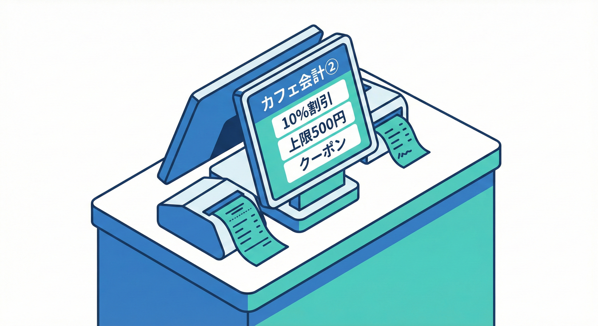

# 第26章：カフェ会計②：割引・クーポン・上限🎟️🧾

この章は、前の「カフェ会計①☕️🧾」に **“仕様追加”** をしても壊れないように、TDDで **割引・クーポン・割引上限** を安全に育てる回だよ〜！🧪💪🌸
（※今回は**条件分岐が増えやすい**ので、テストが超大事！🥺✨）

---

## 今日のゴール🎯✨



* 割引（%）を追加してもテストで守れる🛡️
* クーポン（固定額）を追加してもテストで守れる🎫
* 「割引上限（最大◯円まで）」を入れても破綻しない📏
* 境界値（0円、上限ぴったり、超過）をテストで押さえられる🧠💡

---

## 今回の“やさしめ仕様”📘✨（この章ではこれで固定！）

計算順はこうするよ👇（ここがブレると地獄になる😇）

1. 小計（subtotal）を出す
2. **%割引** を適用（割引額は「小計×率」）
3. **割引上限** があるなら、割引額を「上限まで」に丸める
4. そのあと **クーポン（固定額）** を引く
5. 最終金額がマイナスなら **0円にする**

> つまり：
> **payable = max(0, subtotal - min(subtotal×rate, discountCap) - couponAmount)**

この順番を **テストで固定** していくよ〜！🧪✨

---

## 最小の土台コード（この章のスタート地点）🏗️

前章の完成形が人によって違うので、ここでは「この章で必要な最小形」を置くね😊
（すでに似たクラスがあるなら読み替えOK！🙆‍♀️）

* `CafePricing`：計算担当
* テスト：`CafePricingTests`

---

## Step 1：まずは“割引なし＝そのまま”をテストで固定🧪✅

「仕様追加」するとき、最初にやると安心なのがこれ👇
**“今ある挙動が変わらない”** を先にロックするやつ！🔒✨

```csharp
using Xunit;

public class CafePricingTests
{
    [Fact]
    public void 割引もクーポンも無いなら_支払額は小計と同じ()
    {
        var pricing = new CafePricing();

        var payable = pricing.CalculatePayable(subtotalYen: 1200, discountRate: 0m, couponYen: 0, discountCapYen: null);

        Assert.Equal(1200, payable);
    }
}
```

次に、最短で通す実装（Green）👇

```csharp
public class CafePricing
{
    public int CalculatePayable(int subtotalYen, decimal discountRate, int couponYen, int? discountCapYen)
    {
        return subtotalYen;
    }
}
```

✅ まずはテストが緑！
この時点では「割引率」も「クーポン」もまだ使ってないけどOK🙆‍♀️✨
TDDは“段階的に”が命だよ〜🧪🚦

---

## Step 2：%割引を追加（最初は1ケースだけ）📉✨

次は、超シンプルに1ケースだけ追加するよ😊
例：小計1000円、10%割引 → 900円

### 🔴 Red：テスト追加

```csharp
[Fact]
public void 10パーセント割引なら_小計1000円は900円()
{
    var pricing = new CafePricing();

    var payable = pricing.CalculatePayable(subtotalYen: 1000, discountRate: 0.10m, couponYen: 0, discountCapYen: null);

    Assert.Equal(900, payable);
}
```

### 🟢 Green：最短実装

ここで悩みやすいのが「小数の端数」だけど、今回は日本円なのでわかりやすく👇

* 割引額 = `floor(subtotal * rate)`（端数は切り捨て）
* 支払額 = `subtotal - 割引額`

```csharp
public class CafePricing
{
    public int CalculatePayable(int subtotalYen, decimal discountRate, int couponYen, int? discountCapYen)
    {
        var discountYen = (int)decimal.Floor(subtotalYen * discountRate);
        var payable = subtotalYen - discountYen;
        return payable;
    }
}
```

✅ 緑になった？OK！✨

---

## Step 3：クーポン（固定額）を追加🎫✨

次はクーポン！例：小計1000円、10%割引で900円 → そこから100円引きで800円

### 🔴 Red：テスト追加

```csharp
[Fact]
public void クーポン100円なら_割引後の金額からさらに100円引く()
{
    var pricing = new CafePricing();

    var payable = pricing.CalculatePayable(subtotalYen: 1000, discountRate: 0.10m, couponYen: 100, discountCapYen: null);

    Assert.Equal(800, payable);
}
```

### 🟢 Green：最短実装

```csharp
public class CafePricing
{
    public int CalculatePayable(int subtotalYen, decimal discountRate, int couponYen, int? discountCapYen)
    {
        var discountYen = (int)decimal.Floor(subtotalYen * discountRate);
        var payable = subtotalYen - discountYen - couponYen;
        return payable;
    }
}
```

---

## Step 4：境界値①「マイナスになったら0円」🧊➡️0️⃣

クーポンが強すぎるとマイナスになるよね😵
でもレジで「-50円です！」とはならないので、0円に丸める✨

### 🔴 Red：テスト追加

```csharp
[Fact]
public void クーポンが強すぎてマイナスなら_支払額は0円()
{
    var pricing = new CafePricing();

    var payable = pricing.CalculatePayable(subtotalYen: 300, discountRate: 0m, couponYen: 500, discountCapYen: null);

    Assert.Equal(0, payable);
}
```

### 🟢 Green：実装

```csharp
public class CafePricing
{
    public int CalculatePayable(int subtotalYen, decimal discountRate, int couponYen, int? discountCapYen)
    {
        var discountYen = (int)decimal.Floor(subtotalYen * discountRate);
        var payable = subtotalYen - discountYen - couponYen;

        if (payable < 0) payable = 0;

        return payable;
    }
}
```

---

## Step 5：割引上限（discountCap）を追加📏✨

ここがこの章の山場🏔️🧪
例：小計10,000円、10%割引だと本来1,000円引き
でも上限が500円なら、割引額は500円まで！

* 小計 10,000
* 割引額 min(1000, 500) = 500
* 支払 9,500

### 🔴 Red：テスト追加

```csharp
[Fact]
public void 割引上限500円なら_10パー割引が1000円でも500円まで()
{
    var pricing = new CafePricing();

    var payable = pricing.CalculatePayable(subtotalYen: 10000, discountRate: 0.10m, couponYen: 0, discountCapYen: 500);

    Assert.Equal(9500, payable);
}
```

### 🟢 Green：最短実装

```csharp
public class CafePricing
{
    public int CalculatePayable(int subtotalYen, decimal discountRate, int couponYen, int? discountCapYen)
    {
        var discountYen = (int)decimal.Floor(subtotalYen * discountRate);

        if (discountCapYen.HasValue && discountYen > discountCapYen.Value)
            discountYen = discountCapYen.Value;

        var payable = subtotalYen - discountYen - couponYen;

        if (payable < 0) payable = 0;

        return payable;
    }
}
```

---

## Step 6：境界値②「上限ぴったり」「上限未満」もTheoryで一気に🧪🔁

ここからはテストを増やすターン！✨
同じ形のケース増やすなら **[Theory]** が便利だよ〜😊

```csharp
using Xunit;

public class CafePricingTheoryTests
{
    [Theory]
    [InlineData(10000, 0.10, 500, 9500)] // 本来1000円引き→上限500円
    [InlineData(4000,  0.10, 500, 3600)] // 本来400円引き→上限に届かない
    [InlineData(5000,  0.10, 500, 4500)] // 本来500円引き→上限ぴったり
    public void 割引上限の挙動(int subtotal, decimal rate, int cap, int expectedPayable)
    {
        var pricing = new CafePricing();

        var payable = pricing.CalculatePayable(subtotalYen: subtotal, discountRate: rate, couponYen: 0, discountCapYen: cap);

        Assert.Equal(expectedPayable, payable);
    }
}
```

✅ これで「上限まわり」の事故が激減するよ！🛡️✨

---

## Step 7：組み合わせテスト（上限＋クーポン）🧩🎟️

最後に「上限もクーポンもある」ケースで順番を固定しよう😊

例：

* 小計 10,000
* 10%割引 → 本来 1,000
* 上限 500 → 割引は 500
* クーポン 300 → 最終 9,200

```csharp
[Fact]
public void 上限あり割引の後に_クーポンを引く()
{
    var pricing = new CafePricing();

    var payable = pricing.CalculatePayable(subtotalYen: 10000, discountRate: 0.10m, couponYen: 300, discountCapYen: 500);

    Assert.Equal(9200, payable);
}
```

---

### ここで“設計サイン”👃🚨（超だいじ！）

いまの実装、ifが増えたよね？😇
この状態でさらに「学生割」「セット割」「曜日クーポン」…って増えると、

* `CalculatePayable()` が **if地獄🌋**
* テストも「何を守ってるのか」見えにくい😵

だから、この章の最後に軽くリファクタしておくと超安心✨

---

## ミニ・リファクタ：割引計算を“小さな関数”に分ける🧹✨

目的：**読む人が迷子にならない** 🗺️💕

```csharp
public class CafePricing
{
    public int CalculatePayable(int subtotalYen, decimal discountRate, int couponYen, int? discountCapYen)
    {
        var discountYen = CalculateDiscountYen(subtotalYen, discountRate, discountCapYen);
        var payable = subtotalYen - discountYen - couponYen;
        return ClampToZero(payable);
    }

    private static int CalculateDiscountYen(int subtotalYen, decimal discountRate, int? discountCapYen)
    {
        var discountYen = (int)decimal.Floor(subtotalYen * discountRate);

        if (discountCapYen.HasValue && discountYen > discountCapYen.Value)
            discountYen = discountCapYen.Value;

        return discountYen;
    }

    private static int ClampToZero(int yen) => yen < 0 ? 0 : yen;
}
```

✅ テストはそのまま、コードが読みやすくなった〜！🎉
こういう“小分け”が、次の章の **条件分岐整理（決定表）🗂️** につながるよ✨

---

## AIの使いどころ🤖✨（この章にちょうど効くやつ）

### ① 境界値を一気に出してもらう🧊

* 「割引率・上限・クーポンがあるとき、境界値ケースを列挙して」

👉 出てきた候補から **本当に必要なやつだけ採用** でOK😊✨

### ② “仕様の順番”の確認（事故防止）🚦

* 「割引→上限→クーポン→0円丸め、の順で良い？例も出して」

👉 AIは時々しれっと順番変えるから、**最終はテストで固定**🧪✅

### ③ テスト名を読み物にする📝

* 「このテストの意図が一発で分かる名前を3つ」

---

## 章末ミニ課題🎒✨（手を動かすと強くなる！）

### 課題A：割引率の境界値🧪

* 0% / 100% / それ以上（例：120%）のときどうする？

  * 仕様を決めてテストで固定してね😊
  * （おすすめ：120%は上限が無ければ割引額が小計超えるので、結局0円になる…でも「そもそも入力エラーにする」でもOK！）

### 課題B：クーポンの境界値🎫

* クーポンが負数だったら？（-100円とか）

  * 仕様決めてテストで固定！🧪✨

---

## 今日のまとめ🌸✨

* 仕様追加のときは **小さいテスト→最短実装→すぐ整理** が最強🧪🚦
* 「割引・上限・クーポン」は **順番が命**（テストでロック🔒）
* ifが増えたら、まずは **小さな関数に分ける** だけで未来が楽になる🧹✨

---

## （おまけ）本日時点の“関連ツール最新メモ”🗓️✨

* .NET 10 の最新は **10.0.2（2026-01-13）**、SDKは **10.0.102** と案内されてるよ 📦✨ ([Microsoft][1])
* Visual Studio 2026 の Stable チャネルは **18.2.0（2026-01-13）** が掲載されてるよ 🪟✨ ([Microsoft Learn][2])
* xUnit v3 系のリリースノートに **xunit.v3 3.2.2** が載ってるよ 🧪✨ ([xunit.net][3])
* C# 14 は .NET 10 / Visual Studio 2026 で試せる内容として “What’s new” が更新されてるよ ✍️✨ ([Microsoft Learn][4])

---

次の第27章（条件分岐地獄の回避🗂️）に行く前に、もしよかったらここで👇
「割引（%）」「上限」「クーポン」の**組み合わせ表**（決定表）を一緒に作って、**そのままTheoryに変換**して盤石にしよっか？😊🧪✨

[1]: https://dotnet.microsoft.com/en-US/download/dotnet/10.0?utm_source=chatgpt.com "Download .NET 10.0 (Linux, macOS, and Windows) | .NET"
[2]: https://learn.microsoft.com/en-us/visualstudio/releases/2026/release-history?utm_source=chatgpt.com "Visual Studio Release History"
[3]: https://xunit.net/releases/?utm_source=chatgpt.com "Release Notes"
[4]: https://learn.microsoft.com/en-us/dotnet/csharp/whats-new/csharp-14?utm_source=chatgpt.com "What's new in C# 14"
