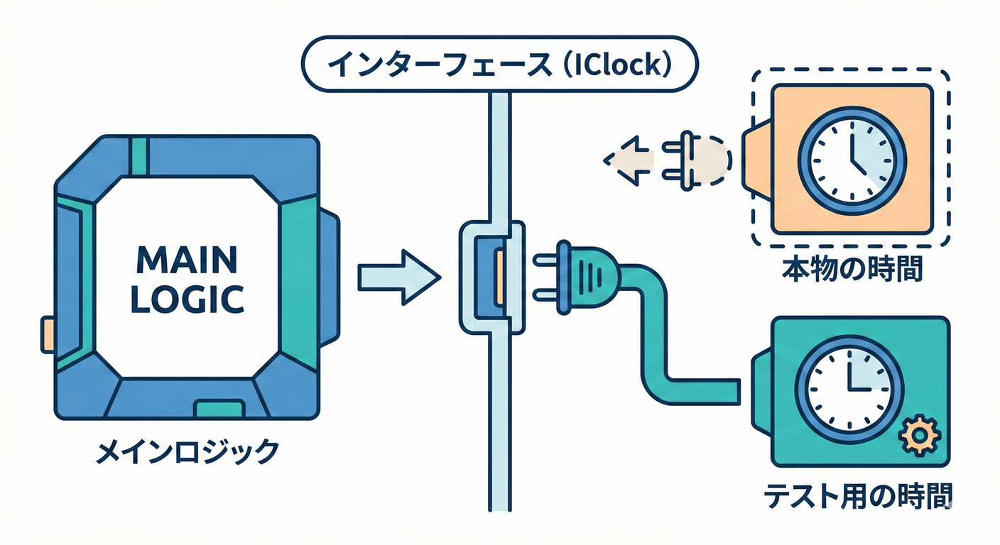

# 第30章：依存の差し替え①：インターフェースの最小導入🔁

この章は「**時間（DateTime.Now）みたいな外部要因を、テストから自由にコントロールできるようにする**」のがゴールだよ〜！⏰🪄
ポイントはたった1つ：**直接触っちゃダメなもの（時間）を “薄い壁” で包む**こと😊

ちなみに現時点の .NET 10 の最新は **10.0.2（2026-01-13）** だよ〜🆕 ([Microsoft][1])
（章の内容自体はバージョンに左右されにくいけど、最新前提は大事なので一応ね✨）

---

## 1) 今日のお題：ハッピーアワー割引☕️🎟️



「15:00〜16:59 の間は **10%割引**！」みたいなルール、よくあるよね😊
でも、実装で **DateTime.Now を直で読む**と…テストが地獄になるの😭💥

* いま16時なら通る✅
* 15時じゃないと落ちる❌
* 深夜にCIが回ったら落ちる❌❌

テストは **毎回同じ結果（決定性）** が命！🎲🚫
だから「時間」は **依存（外部要因）** として扱って、差し替え可能にするよ〜🔁✨

---

## 2) Red：まず “こう書きたいテスト” を書く🟥🧪

「16:00 のときは 10%割引」ってテストを書きたい！

```csharp
using Xunit;

public class HappyHourDiscountTests
{
    [Fact]
    public void 16時なら10パー割引になる()
    {
        // Arrange
        var clock = new FakeClock(new DateTimeOffset(2026, 1, 18, 16, 0, 0, TimeSpan.Zero));
        var calc = new PriceCalculator(clock);

        // Act
        var result = calc.ApplyHappyHourDiscount(1000m);

        // Assert
        Assert.Equal(900m, result);
    }
}
```

はい、ここで多分こうなるよね：

* `FakeClock` って何？❌
* `PriceCalculator(clock)` なんてコンストラクタ無いよ❌

でもOK！これが **TDDのRed**（失敗スタート）だよ〜🟥✨
「こうしたい」から逆算して、必要な形を作るのがTDDの強み😊

---

## 3) 依存を包む “最小のインターフェース” を作る🧱✨

ここがこの章の本題！
**最小**が超大事！！（盛ると後でしんどい）🍰🙅‍♀️

✅ 今日の最小セットはこれだけ：

* `IClock`：今の時刻が取れる
* `SystemClock`：本物の時間を返す（本番用）

```csharp
public interface IClock
{
    DateTimeOffset Now { get; }
}

public sealed class SystemClock : IClock
{
    public DateTimeOffset Now => DateTimeOffset.Now;
}
```

> ここで `Now` 以外（`Today` とか `UtcNow` とか `Elapsed` とか）を詰め込みたくなるけど、今日は我慢〜！😇
> **「必要になったら増やす」** が勝ちだよ🏆✨

---

## 4) テスト用の時計（FakeClock）を作る🕰️🧪

Fakeは **テストプロジェクト側**に置くのが気楽でおすすめ😊
（本番コードをテスト都合で汚さない✨）

```csharp
public sealed class FakeClock : IClock
{
    public FakeClock(DateTimeOffset now) => Now = now;

    public DateTimeOffset Now { get; private set; }

    public void Set(DateTimeOffset now) => Now = now;
}
```

---

## 5) 本体（PriceCalculator）で “IClock しか見ない” ようにする👀🔁

ここが “差し替え” の完成ポイント！

```csharp
public sealed class PriceCalculator
{
    private readonly IClock _clock;

    // 「最小導入」なので、引数なしでも動く形にしておくよ😊
    public PriceCalculator(IClock? clock = null)
        => _clock = clock ?? new SystemClock();

    public decimal ApplyHappyHourDiscount(decimal subtotal)
    {
        var hour = _clock.Now.Hour;

        // 15:00〜16:59 は 10%割引
        if (hour >= 15 && hour < 17)
            return subtotal * 0.9m;

        return subtotal;
    }
}
```

これでテストは「今が何時か」に関係なく、**常に同じ結果**になるよ〜！🎉🎉🎉

---

## 6) Green：テストを増やして境界を固める🟩🧪🧱

境界（ギリギリ）ってバグりやすいから、テストでガチガチにするよ💪✨

```csharp
using Xunit;

public class HappyHourDiscountTests
{
    [Fact]
    public void 16時なら10パー割引になる()
    {
        var clock = new FakeClock(new DateTimeOffset(2026, 1, 18, 16, 0, 0, TimeSpan.Zero));
        var calc = new PriceCalculator(clock);

        var result = calc.ApplyHappyHourDiscount(1000m);

        Assert.Equal(900m, result);
    }

    [Fact]
    public void 14時なら割引されない()
    {
        var clock = new FakeClock(new DateTimeOffset(2026, 1, 18, 14, 59, 0, TimeSpan.Zero));
        var calc = new PriceCalculator(clock);

        var result = calc.ApplyHappyHourDiscount(1000m);

        Assert.Equal(1000m, result);
    }

    [Fact]
    public void 17時ちょうどは割引されない()
    {
        var clock = new FakeClock(new DateTimeOffset(2026, 1, 18, 17, 0, 0, TimeSpan.Zero));
        var calc = new PriceCalculator(clock);

        var result = calc.ApplyHappyHourDiscount(1000m);

        Assert.Equal(1000m, result);
    }
}
```

---

## 7) Refactor：この章でやる “整理” はこれだけでOK🧹✨

この段階のリファクタは、**読みやすさ優先**で軽くね😊

* ✅ `15` と `17` を定数にする（意図が見える）
* ✅ メソッド名を “振る舞い” ベースにする（読み物化📘）
* ✅ テストのArrangeが重くなってきたら「辛さ」のサイン👃🚨（次の章以降で育てる）

---

## 8) よくある落とし穴あるある😵‍💫⚠️

### ❌ インターフェースを盛りすぎる

`IClock` に `Today` や `UtcNow` や `NowTicks` を入れ始めると、未来で破綻しがち…💥
✅ まずは **Nowだけ**！

### ❌ “何でもインターフェース” にする

抽象化はコストもあるよ〜！
✅ **外部要因（時間・乱数・I/O）** みたいな「テストを壊すやつ」からでOK😊

### ❌ テストが “本物の時間” に触ってる

`DateTimeOffset.Now` が1行でもテストに混ざると、決定性が死ぬ😇
✅ テストは Fake だけを見る！

---

## 9) AIの使いどころ（この章の勝ちパターン）🤖✨

AIは便利だけど、**盛りがち**だから「最小」を守る用途で使うのがコツ😊

おすすめプロンプト例👇

* 「`DateTime.Now` の依存を差し替えるための **最小** の `IClock` を提案して」
* 「`FakeClock` の実装を作って。**余計な機能は入れないで**」
* 「このインターフェース名、`IClock` / `ITimeProvider` / `IDateTimeProvider` のどれが誤解少ない？理由も！」

---

## 10) ミニ課題🎒✨（手を動かすやつ）

### 課題A：乱数も差し替えよう🎲🔁

* `Random.Shared.Next()` を直接使ってる箇所を見つけて
* `IRandom`（例：`int Next(int min, int max)`）で包んで
* テストで固定値を返す Fake に差し替えてみてね😊

### 課題B：時計を進めるテストを書こう⏩🕰️

* `FakeClock.Set(...)` を使って
* 「16:59は割引、17:00は割引なし」を **同じテスト内で確認**してみよう✨

---

## 11) 提出物（コミット単位のおすすめ）📦✅

* ✅ `test: 16時は10%割引`（まずRed）
* ✅ `feat: IClock + FakeClock 追加`（差し替えの道具）
* ✅ `feat: PriceCalculator が IClock を使う`（依存の置き換え）
* ✅ `test: 境界(14:59/17:00)追加`（守りを固める）
* ✅ `refactor: マジックナンバー整理`（軽く整える）

---

## 12) 今日のまとめ（超だいじ）🎯✨

* **時間は外部要因** → テストを壊す💥
* だから **IClock で包む** → テストから差し替え可能🔁
* インターフェースは **最小** が正義🍰✅
* 次の章で、この差し替えをもっとキレイにする（DI入門）📦✨

C# 14 は .NET 10 上でサポートされてて、Visual Studio 2026 にも .NET 10 SDK が入ってるよ〜🧩✨ ([Microsoft Learn][2])
xUnit v3 も安定版が出ていて、リリース一覧はここで追えるよ📌 ([xunit.net][3])

---

次は **第31章：コンストラクタ注入（DI入門）📦** で、今日の `IClock` をもっと気持ちよく使える形に整えていくよ〜😊💪✨

[1]: https://dotnet.microsoft.com/en-US/download/dotnet/10.0?utm_source=chatgpt.com "Download .NET 10.0 (Linux, macOS, and Windows) | .NET"
[2]: https://learn.microsoft.com/en-us/dotnet/csharp/whats-new/csharp-14?utm_source=chatgpt.com "What's new in C# 14"
[3]: https://xunit.net/releases/?utm_source=chatgpt.com "Release Notes"
